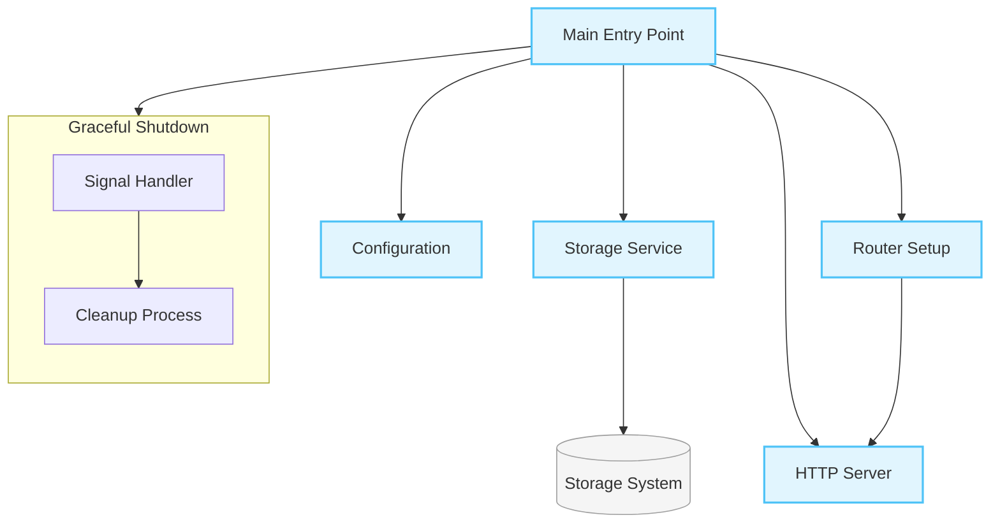

# Backend API Main Entry Point Documentation

> This document describes the main entry point for the AIFAA API server, which handles server initialization, configuration, and graceful shutdown.

## Overview

The main entry point (`main.go`) serves as the bootstrap component for the AIFAA API server, implementing core server initialization logic and graceful shutdown capabilities.

## Architecture



## Components

### Main Function

- **Purpose**: Initializes and orchestrates all server components
- **Dependencies**:
  - Configuration service
  - Storage service
  - Router
  - HTTP server

### Initialization Flow

1. Logger setup
2. Configuration loading
3. Storage service initialization
4. Router setup
5. Server configuration
6. Graceful shutdown handler setup

## Configuration

The server can be configured through environment variables:

- `EXTERNAL_DATA_MOUNT`: Optional mount point for external storage
- Server port (via configuration service)
- Timeouts:
  - Read: 15 seconds
  - Write: 15 seconds
  - Idle: 60 seconds

## Error Handling

The application implements comprehensive error handling for:

- Configuration loading failures
- Storage initialization issues
- Server startup problems
- Graceful shutdown errors

## Usage Example

```go
# Start the server with default configuration
go run cmd/api/main.go

# Start with custom external storage
EXTERNAL_DATA_MOUNT=/path/to/storage go run cmd/api/main.go
```

## Related Files

- `pkg/config/config.go`: Configuration management
- `pkg/routes/routes.go`: API route definitions
- `pkg/services/storage_factory.go`: Storage service initialization
- `pkg/services/storage_service.go`: Storage service interface
