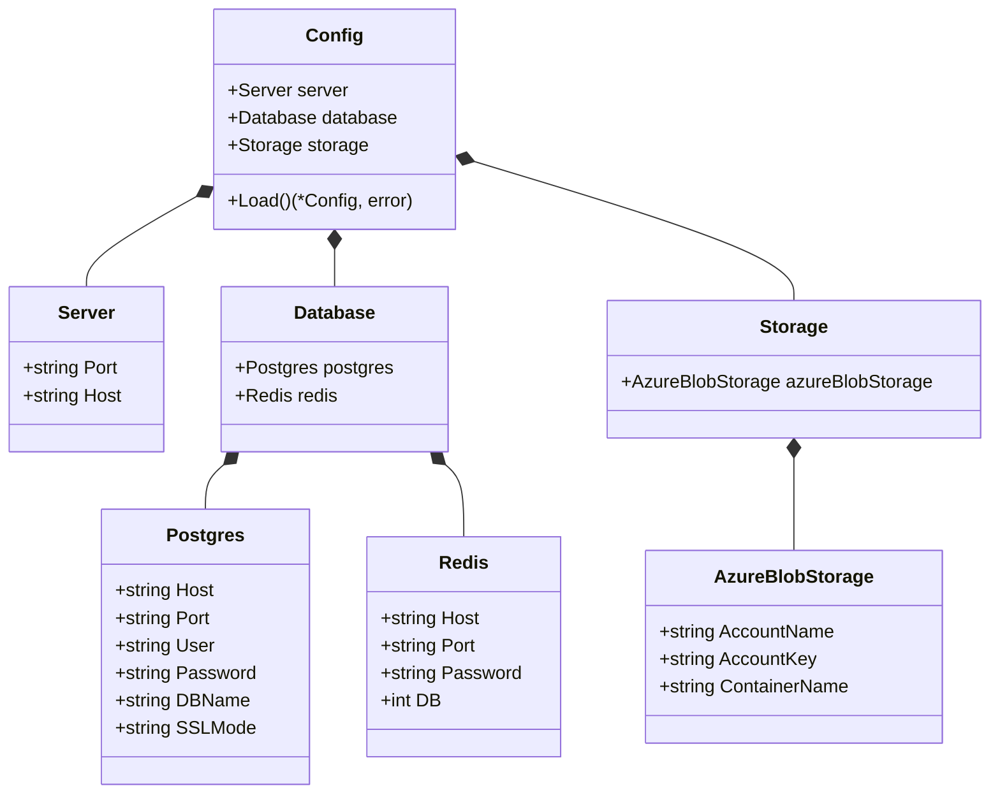

# Configuration Service Documentation

> This document describes the configuration management system for the NIVAI application, which handles loading and managing application settings from both environment variables and configuration files.

## Architecture



## Configuration Sources

The configuration system follows a hierarchical precedence:

1. Environment Variables (Highest Priority)
2. Configuration File (JSON)
3. Default Values (Lowest Priority)

## Environment Variables

### Server Configuration

- `SERVER_PORT`: HTTP server port (default: "8080")
- `SERVER_HOST`: HTTP server host (default: "0.0.0.0")
- `CONFIG_PATH`: Path to configuration file (default: "config.json")

### Database Configuration

- `DB_HOST`: PostgreSQL host (default: "localhost")
- `DB_PORT`: PostgreSQL port (default: "5432")
- `DB_USER`: PostgreSQL user (default: "postgres")
- `DB_PASSWORD`: PostgreSQL password (default: "password")
- `DB_NAME`: Database name (default: "nivai")
- `DB_SSL_MODE`: SSL mode (default: "disable")

### Redis Configuration

- `REDIS_HOST`: Redis host (default: "localhost")
- `REDIS_PORT`: Redis port (default: "6379")
- `REDIS_PASSWORD`: Redis password (default: "")

## Configuration File Format

```json
{
  "server": {
    "port": "8080",
    "host": "0.0.0.0"
  },
  "database": {
    "postgres": {
      "host": "localhost",
      "port": "5432",
      "user": "postgres",
      "password": "password",
      "dbname": "nivai",
      "sslmode": "disable"
    },
    "redis": {
      "host": "localhost",
      "port": "6379",
      "password": "",
      "db": 0
    }
  },
  "storage": {
    "azure_blob_storage": {
      "account_name": "",
      "account_key": "",
      "container_name": ""
    }
  }
}
```

## Usage Example

```go
// Load configuration with environment variables
config, err := config.Load()
if err != nil {
    log.Fatalf("Failed to load configuration: %v", err)
}

// Access configuration values
serverPort := config.Server.Port
dbHost := config.Database.Postgres.Host
```

## Error Handling

The configuration service handles the following error cases:

- Invalid configuration file format
- File system access errors
- Missing required configuration values

## Related Files

- `cmd/api/main.go`: Main application entry point that uses this configuration
- `pkg/services/storage_factory.go`: Storage service that uses storage configuration
