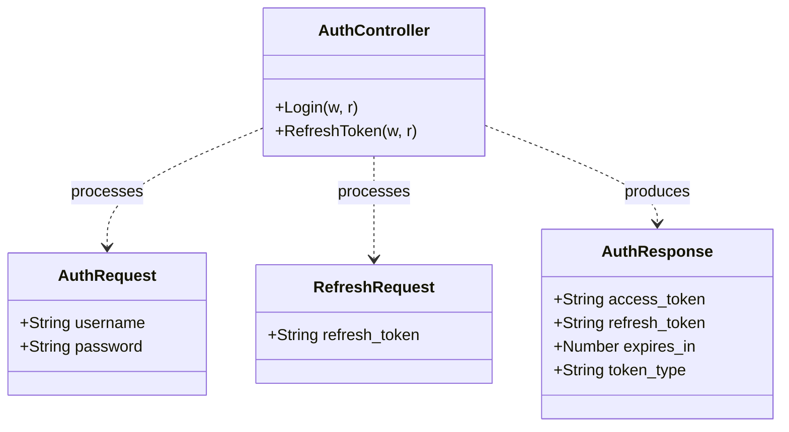
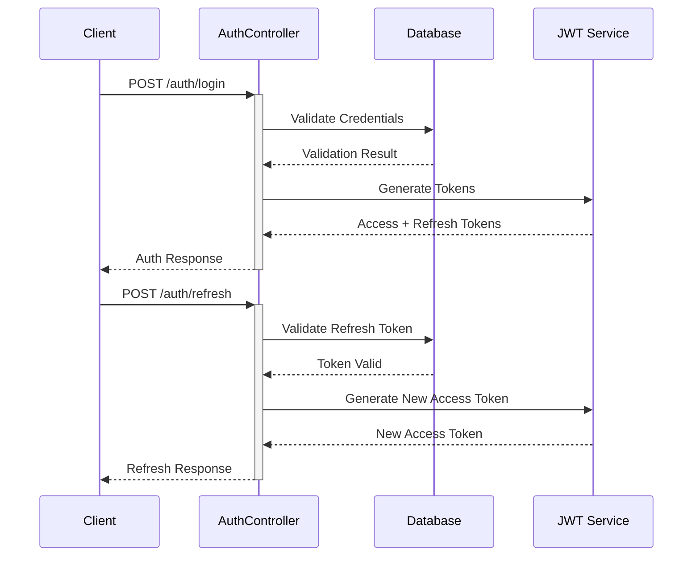

# Authentication Controller Documentation

> This document describes the authentication controller that manages user authentication and token refresh operations in the AIFAA API.

## Architecture



## Authentication Flow



## API Endpoints

### POST /auth/login

Authenticates a user and issues access/refresh tokens.

#### Request Body

```json
{
  "username": "string",
  "password": "string"
}
```

#### Success Response (200 OK)

```json
{
  "access_token": "jwt_token_string",
  "refresh_token": "refresh_token_string",
  "expires_in": 3600,
  "token_type": "Bearer"
}
```

### POST /auth/refresh

Generates a new access token using a valid refresh token.

#### Request Body

```json
{
  "refresh_token": "string"
}
```

#### Success Response (200 OK)

```json
{
  "access_token": "new_jwt_token_string",
  "expires_in": 3600,
  "token_type": "Bearer"
}
```

## Error Handling

### Common Error Responses

1. **Bad Request (400)**

   - Invalid JSON payload
   - Missing required fields
   - Malformed tokens

2. **Unauthorized (401)**

   - Invalid credentials
   - Expired tokens
   - Invalid refresh tokens

3. **Internal Server Error (500)**
   - Database errors
   - Token generation failures

## Security Considerations

1. **Token Management**

   - Short-lived access tokens
   - Secure token storage
   - Token blacklisting
   - HTTPS only

2. **Authentication**

   - Password hashing
   - Rate limiting
   - Brute force protection
   - Input validation

3. **Headers**
   - Secure headers
   - CORS policy
   - Content-Type enforcement

## Future Implementations

### Planned Features

1. **Database Integration**

   - User credential validation
   - Token blacklist management
   - User session tracking

2. **JWT Implementation**

   - Token generation and validation
   - Claims management
   - Token expiration handling

3. **Security Enhancements**
   - MFA support
   - Password policies
   - Account lockout

## Related Files

- `middleware/middleware.go`: JWT validation middleware
- `models/user.go`: User model and authentication
- `config/config.go`: JWT configuration
- `routes/routes.go`: Authentication routes
