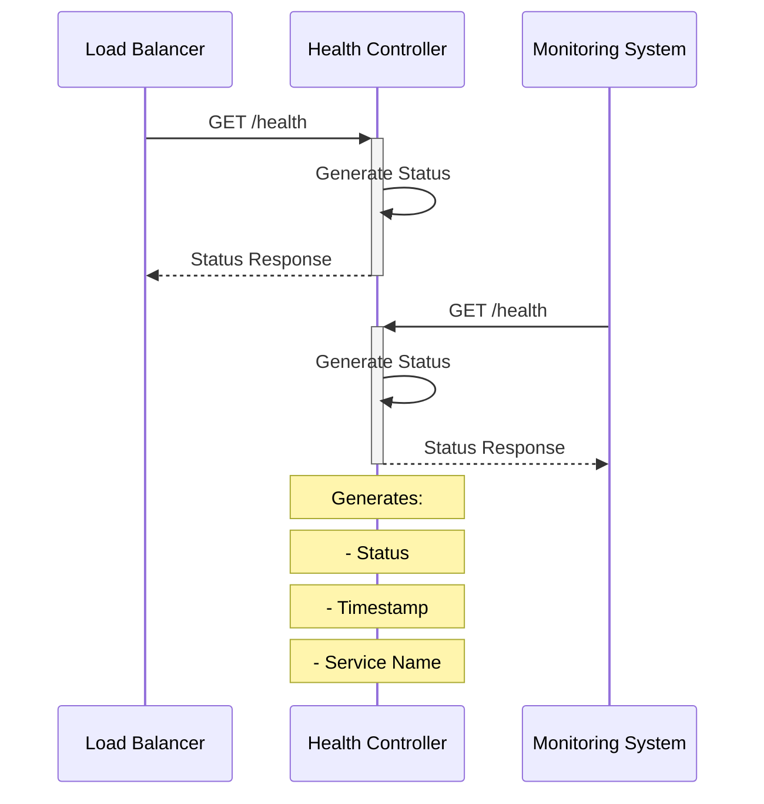

# Health Controller Documentation

> This document describes the health check endpoint that provides system status information for monitoring and load balancing purposes.

## Architecture



## Components

### Health Check Endpoint

- **Path**: `/health`
- **Method**: GET
- **Purpose**: System health monitoring

## Response Format

```json
{
  "status": "ok",
  "timestamp": "2024-01-20T15:04:05Z",
  "service": "NIVAI API"
}
```

### Fields

- `status`: Current service status
- `timestamp`: ISO 8601 formatted time
- `service`: Service identifier

## Error Handling

1. **JSON Encoding Errors**

   - Fails gracefully
   - Returns 500 Internal Server Error
   - Hides implementation details

2. **Response Structure**
   - Always returns valid JSON
   - Consistent format
   - Clear status indication

## Usage Examples

### Monitoring Integration

```bash
# Curl example
curl -i http://api.nivai.com/health

# Expected Response
HTTP/1.1 200 OK
Content-Type: application/json
{
    "status": "ok",
    "timestamp": "2024-01-20T15:04:05Z",
    "service": "NIVAI API"
}
```

### Load Balancer Configuration

```yaml
healthCheck:
  path: /health
  interval: 30s
  timeout: 5s
  successThreshold: 1
  failureThreshold: 3
```

## Performance Considerations

1. **Response Time**

   - Minimal processing
   - No external dependencies
   - Quick response generation

2. **Resource Usage**
   - Low memory footprint
   - No persistent state
   - Efficient JSON encoding

## Security Features

1. **Information Disclosure**

   - Limited system information
   - No sensitive data
   - Sanitized error messages

2. **Access Control**
   - Public endpoint
   - No authentication required
   - Rate limiting recommended

## Related Files

- `routes/routes.go`: Route registration
- `middleware/middleware.go`: Rate limiting
- `infrastructure/kubernetes/ingress.yaml`: Load balancer configuration
