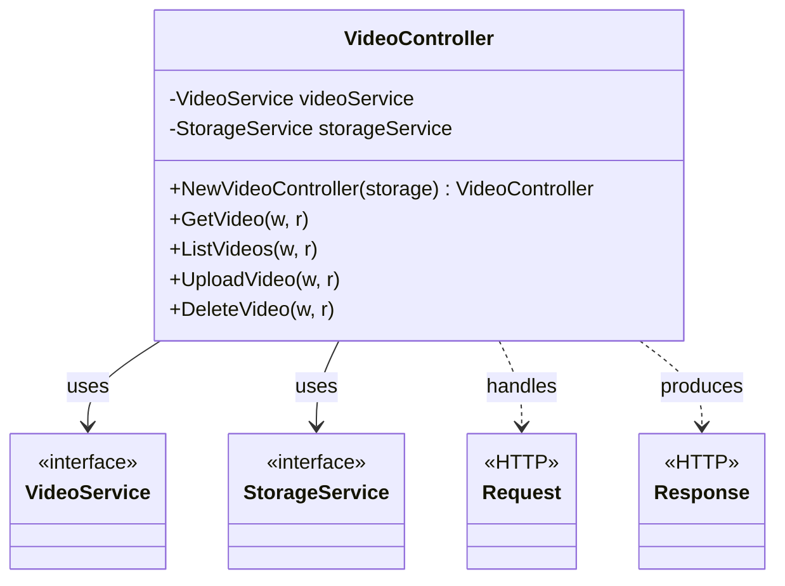
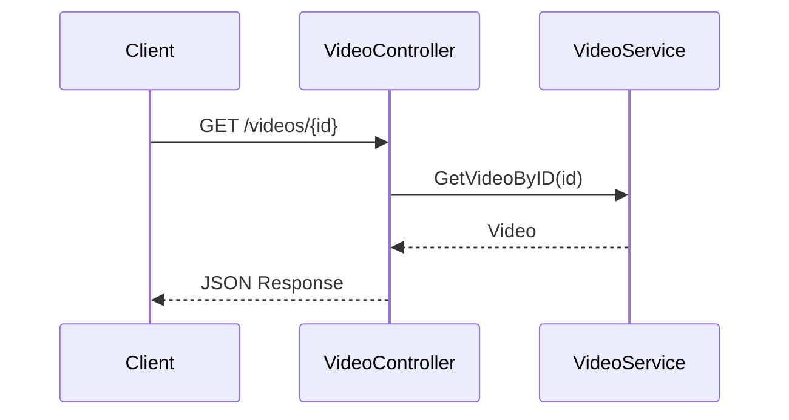
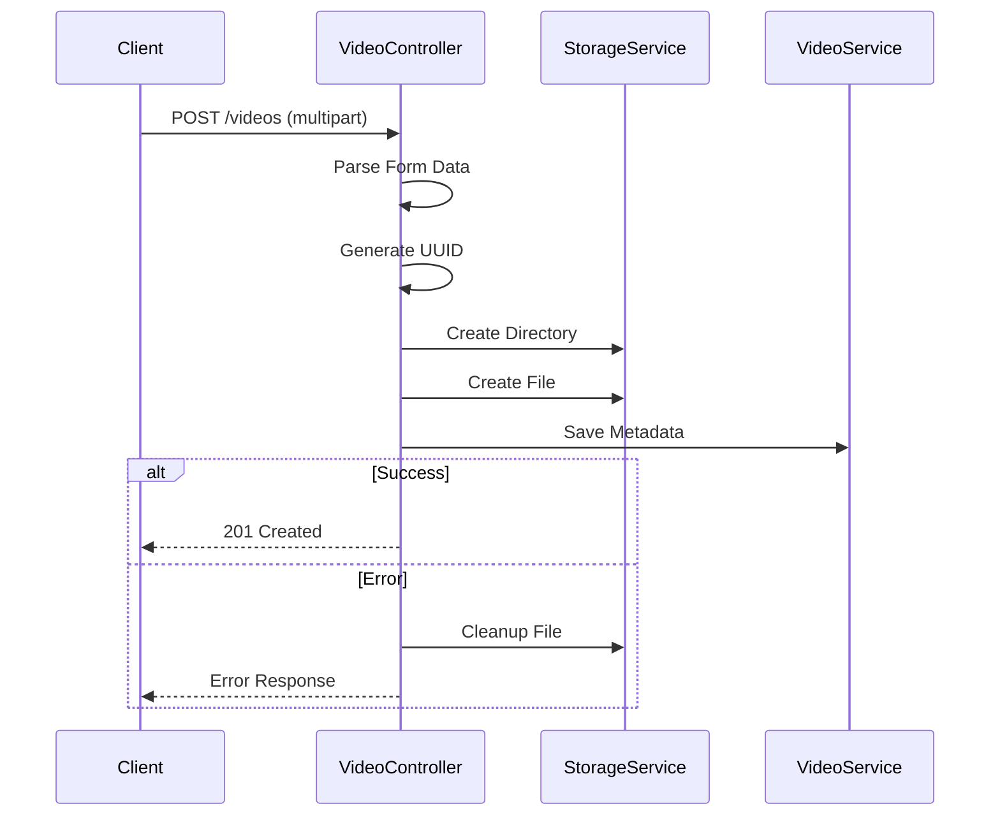

# Video Controller Documentation

> This document describes the HTTP controller that handles video-related endpoints in the AIFAA API, managing video uploads, retrieval, and deletion.

## Architecture



## API Endpoints

### GET /api/v1/videos/{id}

Retrieves a specific video by ID.



### GET /api/v1/videos

Lists videos with pagination and filtering.

Parameters:

- `limit`: Max items per page (default: 10)
- `offset`: Number of items to skip
- Filters:
  - `match_id`
  - `team`
  - `competition`
  - `season`
  - `processing_state`

### POST /api/v1/videos

Handles video uploads.



### DELETE /api/v1/videos/{id}

Removes a video and its associated files.

## Request Processing

### File Upload Handling

- Max file size: 100MB
- Multipart form parsing
- Unique ID generation
- Hierarchical storage path

### Response Formats

#### Success Response

```json
{
  "id": "video-uuid",
  "title": "Video Title",
  "description": "Description",
  "processing_state": "pending",
  "uploaded_at": "2024-01-20T15:04:05Z",
  "file_size": 1024,
  "content_type": "video/mp4",
  "filename": "original.mp4"
}
```

#### Error Responses

- 400: Bad Request (invalid input)
- 404: Not Found
- 413: Payload Too Large
- 500: Internal Server Error

## Security Considerations

1. **Upload Protection**

   - File size limits
   - Content type validation
   - Secure file paths

2. **Access Control**
   - Authentication (implemented separately)
   - Resource ownership validation
   - Safe file handling

## Performance Optimizations

1. **Upload Handling**

   - Streaming file processing
   - Memory-efficient copying
   - Concurrent metadata updates

2. **Response Management**
   - Proper resource cleanup
   - Connection handling
   - Error recovery

## Usage Example

```go
// Initialize controller
controller := NewVideoController(storageService)

// Register routes
router.HandleFunc("/api/v1/videos", controller.ListVideos).Methods("GET")
router.HandleFunc("/api/v1/videos/{id}", controller.GetVideo).Methods("GET")
router.HandleFunc("/api/v1/videos", controller.UploadVideo).Methods("POST")
router.HandleFunc("/api/v1/videos/{id}", controller.DeleteVideo).Methods("DELETE")
```

## Related Files

- `services/video_service.go`: Business logic implementation
- `models/video.go`: Video data model
- `routes/routes.go`: Route registration
