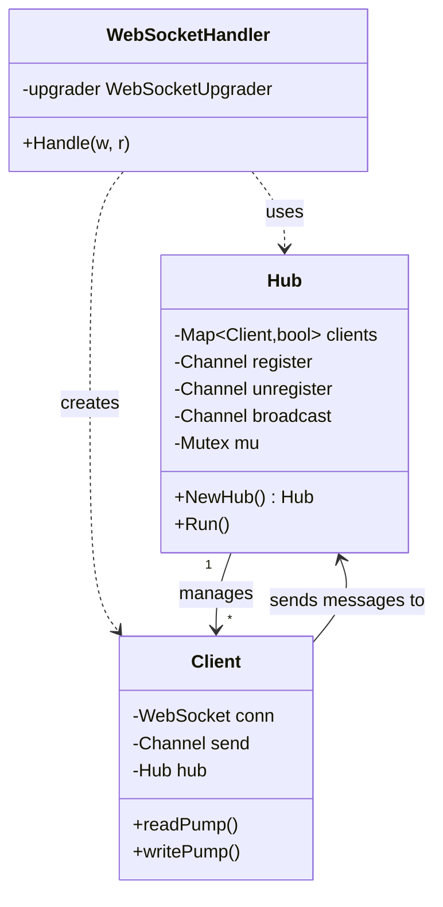
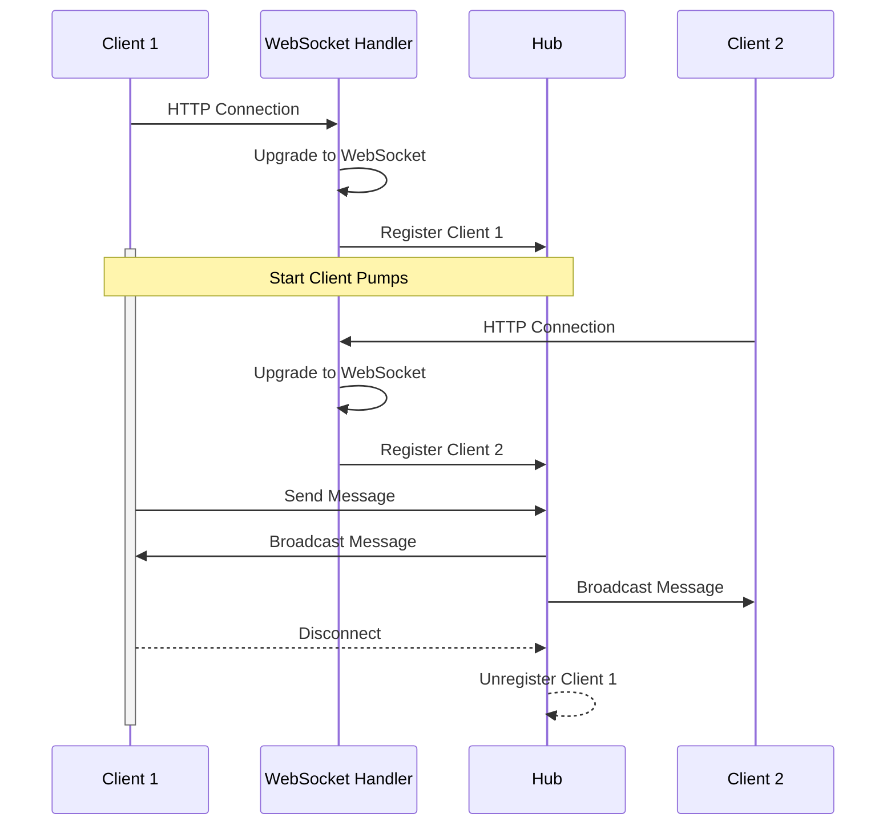
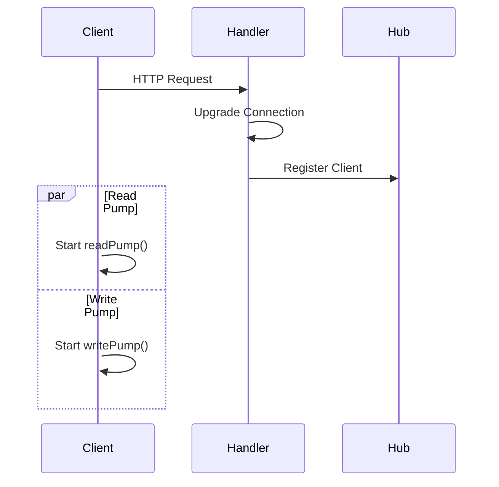
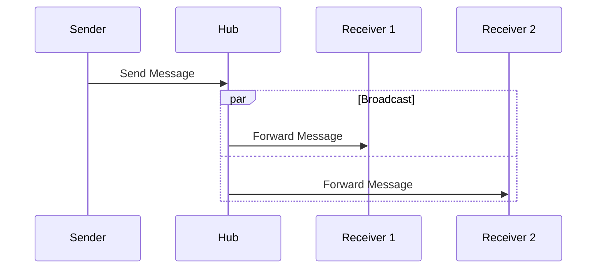

# WebSocket Controller Documentation

> This document describes the WebSocket controller that enables real-time bidirectional communication between clients and the NIVAI API using a hub-based publish/subscribe pattern.

## Architecture



## Message Flow



## Components

### Hub

Central message broker that:

```go
type Hub struct {
    clients    map[*Client]bool   // Active connections
    register   chan *Client       // Registration requests
    unregister chan *Client      // Unregistration requests
    broadcast  chan []byte        // Broadcast messages
    mu         sync.Mutex        // Thread safety
}
```

### Client

Represents a WebSocket connection:

```go
type Client struct {
    conn *websocket.Conn     // WebSocket connection
    send chan []byte         // Message buffer
    hub  *Hub               // Hub reference
}
```

## Connection Lifecycle

### 1. Connection Establishment



### 2. Message Broadcasting



## Configuration

### WebSocket Settings

```go
upgrader := websocket.Upgrader{
    ReadBufferSize: 1024,
    WriteBufferSize: 1024,
    CheckOrigin: func(r *http.Request) bool {
        return true  // Configure for production
    },
}
```

## Performance Features

### 1. Message Buffering

- 256 message buffer per client
- Non-blocking broadcast operations
- Automatic client cleanup on buffer overflow

### 2. Concurrency Management

- Thread-safe client management
- Goroutine-based message pumps
- Mutex-protected shared resources

## Error Handling

1. **Connection Errors**

   - Unexpected closure detection
   - Graceful connection termination
   - Resource cleanup

2. **Message Handling**
   - Buffer overflow protection
   - Failed delivery handling
   - Client removal on errors

## Usage Examples

### Client Connection

```javascript
const ws = new WebSocket("ws://api.nivai.com/ws");

ws.onopen = () => {
  console.log("Connected to WebSocket");
};

ws.onmessage = (event) => {
  console.log("Received:", event.data);
};

ws.onclose = () => {
  console.log("Disconnected from WebSocket");
};
```

### Server Broadcasting

```go
// Broadcast to all clients
hub.broadcast <- []byte("Update notification")
```

## Security Considerations

1. **Connection Security**

   - TLS encryption required
   - Origin validation needed
   - Authentication integration

2. **Message Validation**
   - Input sanitization
   - Size limits
   - Rate limiting

## Related Files

- `routes/routes.go`: WebSocket route registration
- `middleware/middleware.go`: WebSocket middleware
- `services/video_service.go`: Real-time video updates
