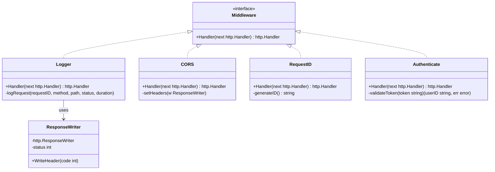
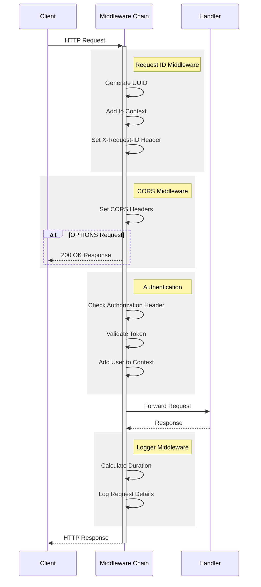

# Middleware Documentation

> This document describes the middleware components that provide cross-cutting concerns like logging, CORS, request tracking, and authentication for the AIFAA API.

## Architecture



## Request Flow



## Components

### Context Keys

```go
const (
    RequestIDKey ContextKey = "requestID"
    UserIDKey    ContextKey = "userID"
)
```

### Logger Middleware

Captures HTTP request metrics and timing:

- Request method and path
- Response status code
- Request duration
- Request ID for tracing

### CORS Middleware

Configures Cross-Origin Resource Sharing:

- Allows all origins (\*) for development
- Supports GET, POST, PUT, DELETE, OPTIONS
- Allows Content-Type and Authorization headers

### RequestID Middleware

Adds request tracing capabilities:

- Generates UUID for each request
- Adds ID to request context
- Sets X-Request-ID response header

### Authentication Middleware

Validates JWT tokens for protected routes:

- Extracts Bearer token from Authorization header
- Validates token format and signature
- Adds authenticated user to request context

## Configuration

### CORS Settings

```go
Access-Control-Allow-Origin: *
Access-Control-Allow-Methods: GET, POST, PUT, DELETE, OPTIONS
Access-Control-Allow-Headers: Content-Type, Authorization
```

### Logger Format

```
[request-id] METHOD /path/to/resource STATUS_CODE DURATION
```

## Error Handling

### Authentication Errors

- Missing Authorization header: 401 Unauthorized
- Invalid token format: 401 Unauthorized
- Invalid/expired token: 401 Unauthorized

### Response Handling

- Captures response status codes
- Ensures headers are set correctly
- Handles preflight requests properly

## Usage Examples

### Middleware Chain Setup

```go
router := mux.NewRouter()

// Apply middleware chain
router.Use(middleware.RequestID)
router.Use(middleware.Logger)
router.Use(middleware.CORS)
router.Use(middleware.Authenticate)
```

### Protected Route Example

```go
// This route requires authentication
router.HandleFunc("/api/protected", handler).Methods("GET")

// This route bypasses authentication
router.HandleFunc("/api/public", handler).Methods("GET")
```

## Security Considerations

1. **Authentication**

   - Token validation
   - Secure header handling
   - Context isolation

2. **CORS Security**

   - Origin validation needed for production
   - Method restrictions
   - Header restrictions

3. **Request Tracing**
   - Unique request IDs
   - Secure logging practices
   - No sensitive data exposure

## Related Files

- `routes/routes.go`: Middleware registration
- `controllers/*.go`: Protected endpoint handlers
- `config/config.go`: Security configuration
