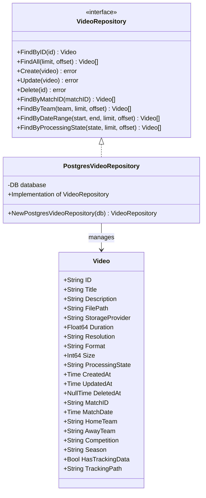
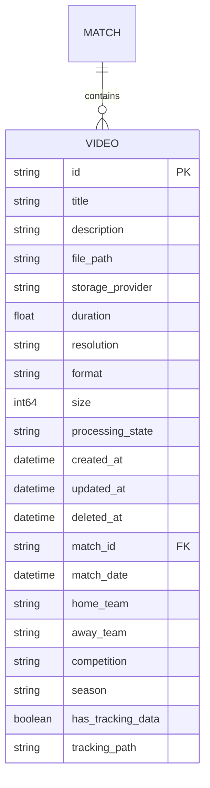
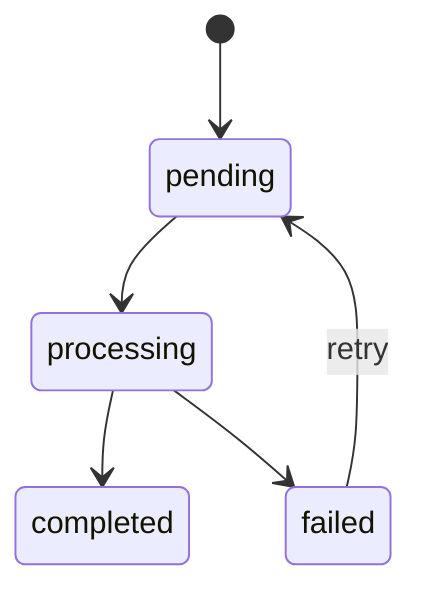

# Video Model Documentation

> This document describes the video model that represents video files and their metadata in the NIVAI system, including the repository pattern implementation for data access.

## Architecture



## Data Model

### Video Entity



## Processing States



## Repository Pattern

### Interface Definition

```go
type VideoRepository interface {
    // Core operations
    FindByID(id string) (*Video, error)
    FindAll(limit, offset int) ([]*Video, error)
    Create(video *Video) error
    Update(video *Video) error
    Delete(id string) error

    // Specialized queries
    FindByMatchID(matchID string) ([]*Video, error)
    FindByTeam(teamName string, limit, offset int) ([]*Video, error)
    FindByDateRange(start, end time.Time, limit, offset int) ([]*Video, error)
    FindByProcessingState(state string, limit, offset int) ([]*Video, error)
}
```

## Database Operations

### Query Example

```sql
-- Base video query with soft delete support
SELECT id, title, description, file_path, storage_provider,
       duration, resolution, format, size, processing_state,
       created_at, updated_at, deleted_at,
       match_id, match_date, home_team, away_team,
       competition, season, has_tracking_data, tracking_path
FROM videos
WHERE deleted_at IS NULL
```

## Usage Examples

### Creating a New Video

```go
video := &Video{
    ID: uuid.New().String(),
    Title: "Match Highlights",
    Description: "Key moments from the match",
    ProcessingState: "pending",
    CreatedAt: time.Now(),
    UpdatedAt: time.Now(),
    MatchID: "match123",
    HomeTeam: "Team A",
    AwayTeam: "Team B"
}

err := repo.Create(video)
```

### Retrieving Videos

```go
// Get by ID
video, err := repo.FindByID("video123")

// List with pagination
videos, err := repo.FindAll(10, 0)

// Find by match
videos, err := repo.FindByMatchID("match123")
```

## Error Handling

1. **Input Validation**

   - ID validation
   - Required fields checking
   - Format validation

2. **Database Errors**
   - Not found handling
   - Duplicate key handling
   - Connection errors

## Performance Considerations

1. **Query Optimization**

   - Indexed fields
   - Pagination support
   - Soft deletes

2. **Data Loading**
   - Eager vs. lazy loading
   - Batch operations
   - Connection pooling

## Security Features

1. **Data Protection**

   - Soft delete support
   - Audit timestamps
   - No permanent deletion

2. **Access Control**
   - Repository pattern abstraction
   - Controlled data access
   - Input sanitization

## Related Files

- `services/video_service.go`: Business logic
- `controllers/video_controller.go`: HTTP handlers
- `migrations/videos.sql`: Database schema
