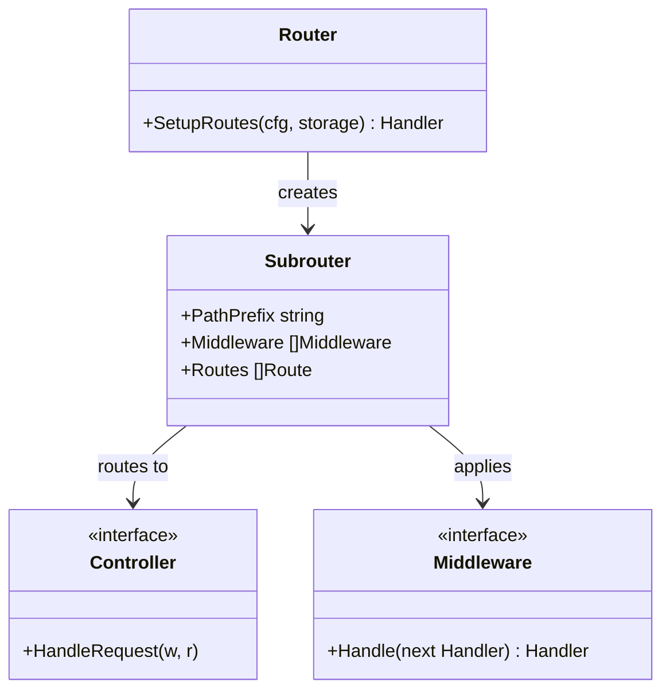
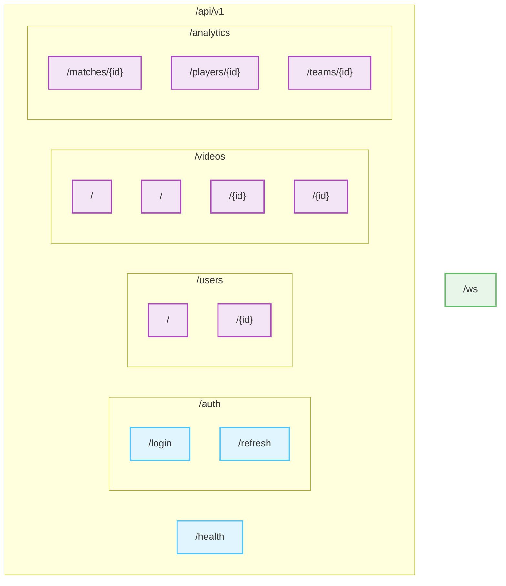
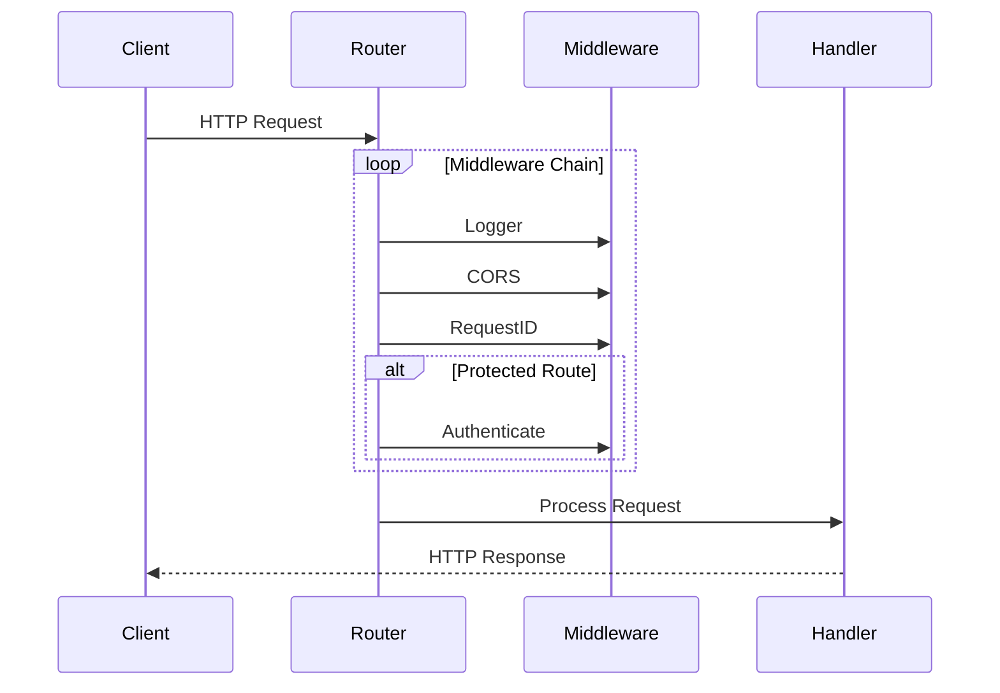

# Routes Documentation

> This document describes the routing system that manages API endpoints, middleware application, and request handling in the AIFAA API.

## Architecture



## API Structure



## Endpoint Groups

### Public Endpoints

- `GET /api/v1/health`: System health check
- `POST /api/v1/auth/login`: User authentication
- `POST /api/v1/auth/refresh`: Token refresh
- `GET /ws`: WebSocket connection

### Protected Endpoints

#### User Management

- `GET /api/v1/users`: List users
- `GET /api/v1/users/{id}`: Get specific user

#### Video Operations

- `GET /api/v1/videos`: List videos
- `POST /api/v1/videos`: Upload video
- `GET /api/v1/videos/{id}`: Get video
- `DELETE /api/v1/videos/{id}`: Delete video

#### Analytics

- `GET /api/v1/analytics/matches/{id}`: Match analysis
- `GET /api/v1/analytics/players/{id}`: Player statistics
- `GET /api/v1/analytics/teams/{id}`: Team performance

## Middleware Application



## Configuration

### Middleware Setup

```go
// Global middleware applied to all routes
- Logger: Request logging
- CORS: Cross-origin resource sharing
- RequestID: Request tracking

// Route-specific middleware
- Authenticate: JWT validation for protected routes
```

### Route Organization

- Version prefixed (`/api/v1`)
- Feature-based subrouters
- Hierarchical middleware application
- RESTful endpoint design

## Security Features

1. **Authentication Control**

   - Public endpoints clearly separated
   - Protected routes require valid JWT
   - Token refresh mechanism

2. **Request Protection**

   - CORS policy enforcement
   - Request tracking
   - Logging for audit trails

3. **API Versioning**
   - Version prefix for all endpoints
   - Future compatibility support
   - Clean upgrade path

## Usage Examples

### Accessing Protected Routes

```http
GET /api/v1/videos HTTP/1.1
Authorization: Bearer <jwt_token>
```

### WebSocket Connection

```javascript
const ws = new WebSocket("ws://api.nivai.com/ws");
ws.onmessage = (event) => {
  console.log("Update:", event.data);
};
```

## Related Files

- `middleware/middleware.go`: Middleware implementations
- `controllers/*.go`: Route handlers
- `config/config.go`: API configuration
