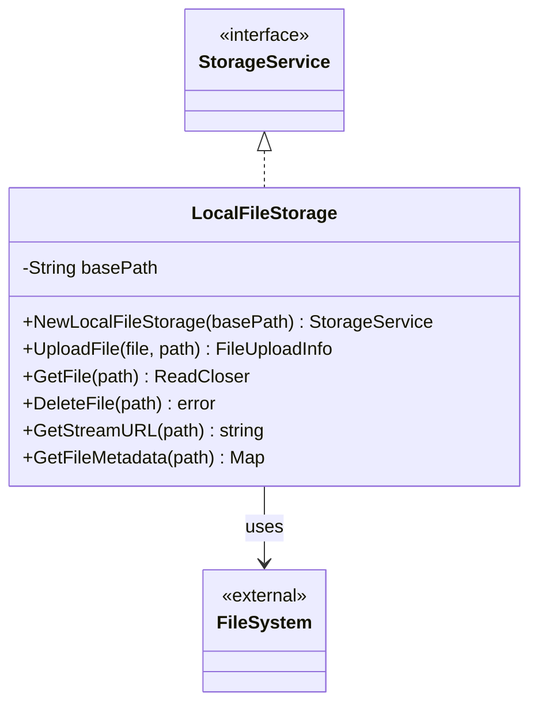

# Local File Storage Service Documentation

> This document describes the local file storage implementation that provides file system-based storage operations for development and testing environments.

## Architecture



## Components

### LocalFileStorage

Implements the StorageService interface using local filesystem operations:

- **Base Path Management**: Centralized storage location
- **Directory Structure**: Automatic directory creation
- **File Operations**: CRUD operations on files
- **Metadata Support**: File system attribute access

## File Operations

### Upload Process

1. Path Validation

   - Constructs full file path
   - Creates necessary directories
   - Validates permissions

2. File Writing
   - Creates destination file
   - Streams content copying
   - Maintains original format

### File Access

- Direct file system operations
- Streaming file access
- Path-based file management
- Proper resource cleanup

## Security Considerations

1. **Path Security**

   - Base path containment
   - Directory traversal prevention
   - Permission validation

2. **File Safety**
   - Atomic operations where possible
   - Resource cleanup guarantees
   - Error state handling

## Performance Features

1. **Streaming Support**

   - Memory-efficient file copying
   - Direct file system access
   - No unnecessary buffering

2. **Metadata Operations**
   - Fast attribute access
   - Minimal system calls
   - Efficient caching

## Error Handling

Comprehensive error management for:

- Missing files/directories
- Permission issues
- Resource limitations
- I/O failures

## Usage Examples

```go
// Initialize storage
storage, err := NewLocalFileStorage("/path/to/storage")
if err != nil {
    log.Fatal(err)
}

// Upload file
info, err := storage.UploadFile(fileData, "videos/sample.mp4")

// Access file metadata
metadata, err := storage.GetFileMetadata("videos/sample.mp4")

// Get file content
reader, err := storage.GetFile("videos/sample.mp4")
defer reader.Close()
```

## Limitations

1. **URL Generation**

   - Limited to file:// URLs
   - Browser security restrictions
   - No streaming optimization

2. **Scalability**
   - Single machine scope
   - No distributed capabilities
   - Local disk space limits

## Related Files

- `storage_service.go`: Interface definition
- `storage_factory.go`: Factory for storage creation
- `config/config.go`: Storage configuration
