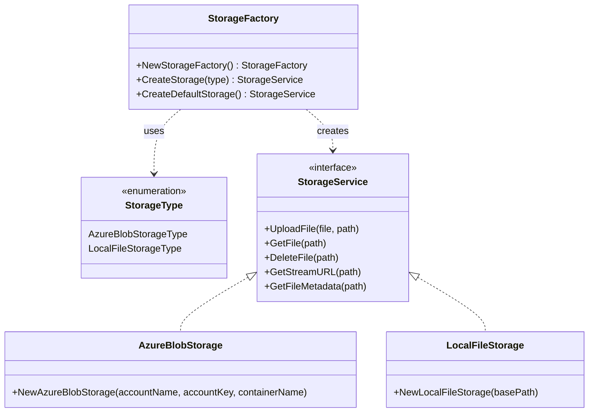

# Storage Factory Documentation

> This document describes the storage factory system that creates and configures different storage service implementations based on the application's configuration.

## Architecture



## Components

### StorageFactory

The factory implements the Factory design pattern to:

- Abstract storage implementation creation
- Provide configuration-based storage selection
- Enable runtime storage provider switching
- Handle environment-based configuration

### Storage Types

1. **Azure Blob Storage**

   - Cloud-based storage solution
   - Requires Azure credentials
   - Suitable for production deployments

2. **Local File Storage**
   - File system-based storage
   - Requires local directory path
   - Suitable for development/testing

## Configuration

### Environment Variables

#### Azure Blob Storage

```bash
AZURE_STORAGE_ACCOUNT=your_account_name
AZURE_STORAGE_KEY=your_account_key
AZURE_STORAGE_CONTAINER=your_container_name
```

#### Local File Storage

```bash
EXTERNAL_DATA_PATH=/path/to/storage
```

## Storage Selection Logic

### Default Storage Resolution

1. Checks for local file storage configuration
   - Verifies EXTERNAL_DATA_PATH exists
   - Validates path accessibility
2. Falls back to Azure Blob Storage if configured
3. Returns error if no valid configuration exists

## Error Handling

The factory handles several error scenarios:

- Missing configuration values
- Invalid storage type requests
- Inaccessible storage locations
- Initialization failures

## Usage Examples

```go
// Create factory
factory := NewStorageFactory()

// Create specific storage type
azureStorage, err := factory.CreateStorage(AzureBlobStorageType)
localStorage, err := factory.CreateStorage(LocalFileStorageType)

// Create default storage based on environment
storage, err := factory.CreateDefaultStorage()
```

## Best Practices

1. **Configuration Management**

   - Use environment variables for sensitive data
   - Validate all required configuration
   - Provide clear error messages

2. **Storage Selection**
   - Use CreateDefaultStorage for automatic resolution
   - Explicitly specify type when required
   - Validate storage availability before use

## Related Files

- `storage_service.go`: Storage service interface definition
- `file_storage_service.go`: Local storage implementation
- `config/config.go`: Configuration management
