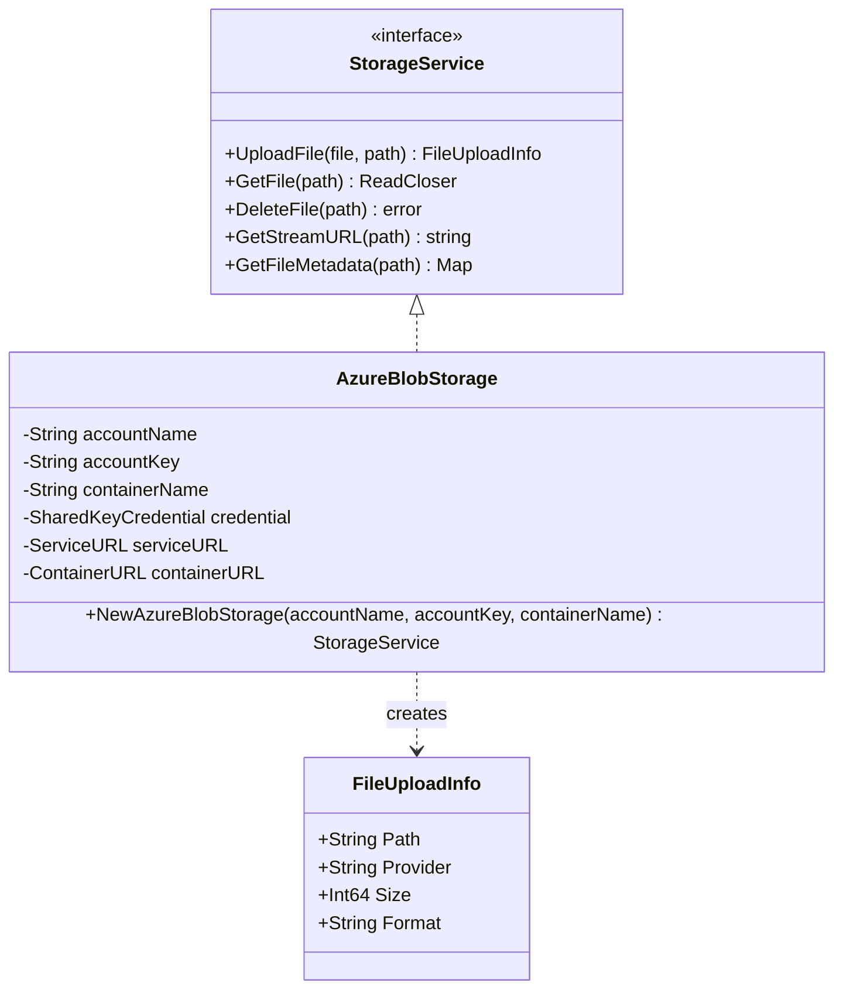

# Storage Service Documentation

> This document describes the storage service system that provides a unified interface for file storage operations, with implementation for Azure Blob Storage.

## Architecture



## Components

### StorageService Interface

Defines the core operations for file storage:

- **UploadFile**: Uploads files to storage
- **GetFile**: Retrieves stored files
- **DeleteFile**: Removes files from storage
- **GetStreamURL**: Generates streaming URLs
- **GetFileMetadata**: Retrieves file metadata

### AzureBlobStorage Implementation

Implements StorageService using Azure Blob Storage with features:

- Secure credential management
- Configurable retry policies
- Streaming upload/download
- Temporary access URLs via SAS tokens
- Comprehensive metadata support

## Configuration

### Azure Blob Storage Settings

```json
{
  "storage": {
    "azure_blob_storage": {
      "account_name": "your_account_name",
      "account_key": "your_account_key",
      "container_name": "your_container"
    }
  }
}
```

## File Operations

### Upload Process

1. File validation
2. Stream buffering (2MB chunks)
3. Concurrent upload with 3 buffers
4. Metadata generation

### Streaming Access

- Generates HTTPS-only SAS URLs
- 1-hour validity period
- Read-only permissions
- Automatic retry handling

## Error Handling

The service handles various error scenarios:

- Invalid credentials
- Network failures
- File access issues
- Concurrent operation conflicts

## Performance Optimizations

1. **Upload Streaming**

   - 2MB buffer size
   - 3 concurrent buffers
   - Automatic retry logic

2. **Download Streaming**
   - Chunked downloads
   - Retry mechanism
   - Memory-efficient processing

## Usage Examples

```go
// Initialize storage service
storage, err := NewAzureBlobStorage(accountName, accountKey, containerName)
if err != nil {
    log.Fatal(err)
}

// Upload file
info, err := storage.UploadFile(fileData, "path/to/file.mp4")

// Generate streaming URL
url, err := storage.GetStreamURL("path/to/file.mp4")

// Get file metadata
metadata, err := storage.GetFileMetadata("path/to/file.mp4")
```

## Related Files

- `storage_factory.go`: Factory for creating storage service instances
- `file_storage_service.go`: Local file system storage implementation
- `config/config.go`: Storage configuration management
