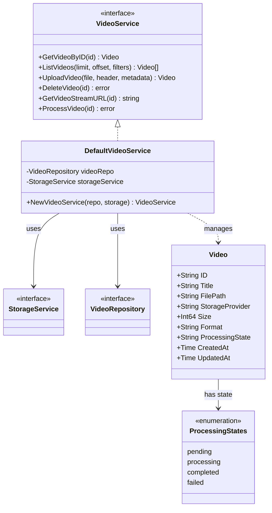
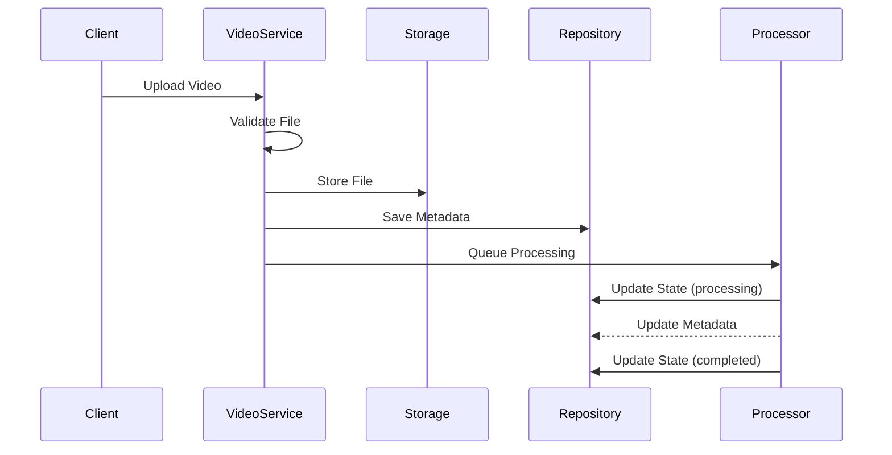

# Video Service Documentation

> This document describes the video service that manages video uploads, processing, and streaming capabilities in the NIVAI application.

## Architecture



## Components

### Video Service Interface

Provides high-level video operations:

- Video retrieval and listing
- Upload management
- Streaming URL generation
- Processing coordination

### Default Implementation

Features:

- File validation
- Metadata management
- Storage coordination
- Processing state tracking

## Video Processing Flow



## File Organization

### Storage Path Structure

```
videos/
├── matches/
│   └── {match_id}/
│       └── {YYYY/MM/DD}/
│           └── {video_id}.{ext}
└── uploads/
    └── {YYYY/MM/DD}/
        └── {video_id}.{ext}
```

## Supported Formats

Video formats supported:

- MP4 (.mp4)
- QuickTime (.mov)
- AVI (.avi)
- Matroska (.mkv)
- WebM (.webm)

## Error Handling

### Common Errors

- `ErrVideoNotFound`: Video not in repository
- `ErrInvalidVideo`: Invalid video data/format
- `ErrStorageFailed`: Storage operation failure

## Configuration

### Processing Settings

- Default page size: 10 videos
- Processing states: pending, processing, completed
- File organization: date-based hierarchy

## Usage Examples

```go
// Initialize service
videoService := NewVideoService(videoRepo, storageService)

// Upload video
video, err := videoService.UploadVideo(file, header, metadata)

// Get stream URL
url, err := videoService.GetVideoStreamURL(video.ID)

// List videos with filters
filters := map[string]string{
    "match_id": "match123",
    "processing_state": "completed"
}
videos, err := videoService.ListVideos(10, 0, filters)
```

## Related Files

- `models/video.go`: Video data model
- `storage_service.go`: Storage interface
- `controllers/video_controller.go`: HTTP handlers
