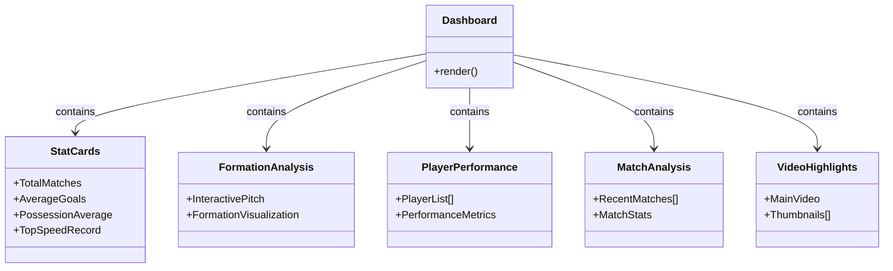
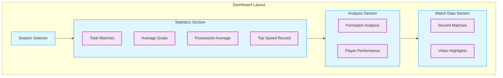
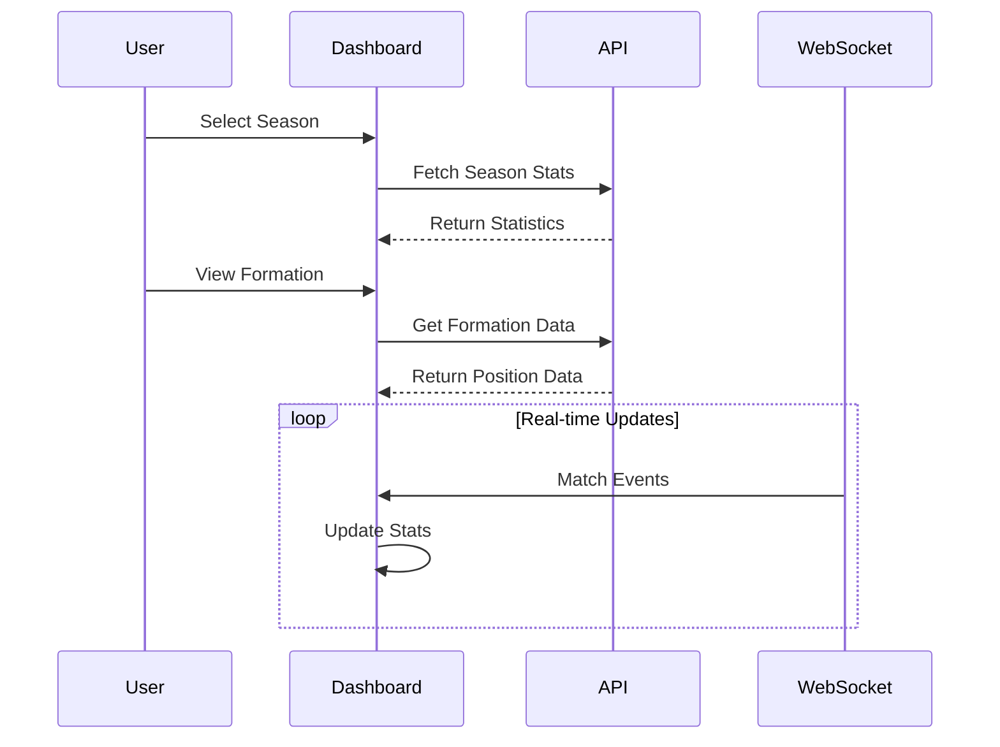

# Dashboard Page Documentation

> This document describes the main analytics dashboard that serves as the central hub for football performance insights and match analysis in the AIFAA platform.

## Architecture



## Component Layout



## Data Flow



## Components

### 1. Statistics Cards

- Total Matches Counter
- Average Goals per Match
- Team Possession Statistics
- Player Speed Records

### 2. Interactive Formation Analysis

```typescript
interface FormationData {
  positions: PlayerPosition[];
  heatmap: HeatmapData;
  movements: MovementPattern[];
}
```

### 3. Player Performance Tracker

```typescript
interface PlayerMetrics {
  name: string;
  team: string;
  rating: number;
  performance: number; // 0-100
}
```

## State Management

### Season Selection

```typescript
type Season = {
  id: string;
  name: string;
  startDate: Date;
  endDate: Date;
  isActive: boolean;
};
```

### Match Status

```typescript
type MatchStatus = "complete" | "processing" | "pending";
```

## Styling

### Card Components

```css
baseCard: .card {
  @apply bg-white overflow-hidden shadow rounded-lg;
}

statsCard: .stats-card {
  @apply px-4 py-5 sm:p-6;
}

metricDisplay: .metric {
  @apply mt-1 text-3xl font-semibold text-gray-900;
}
```

## Interactive Features

### 1. Formation Visualization

- Pixi.js Canvas Integration
- Player Position Dragging
- Formation Pattern Analysis

### 2. Video Controls

- Playback Controls
- Thumbnail Navigation
- Picture-in-Picture Support

## Performance Optimizations

1. **Data Loading**

   - Lazy video loading
   - Progressive stat updates
   - Cached formation data

2. **Rendering**
   - Virtualized player lists
   - Optimized canvas updates
   - Debounced resize handlers

## Usage Example

```typescript
// Dashboard container with real-time updates
import { useWebSocket } from "@/hooks/useWebSocket";

function DashboardContainer() {
  const { data, isConnected } = useWebSocket("/ws/matches");

  return <Dashboard realtimeData={data} isLive={isConnected} />;
}
```

## Related Files

- `components/StatCard.tsx`: Reusable stat card component
- `components/FormationView.tsx`: Interactive pitch component
- `hooks/useMatchData.ts`: Match data fetching hook
- `services/api.ts`: API service integration
