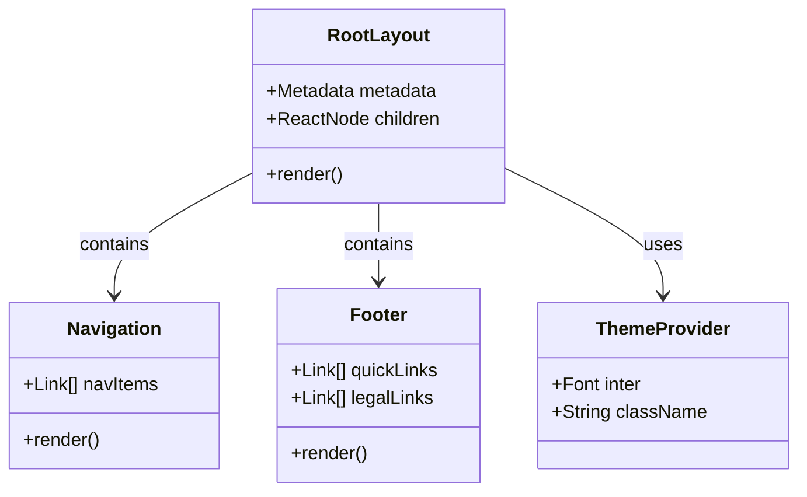
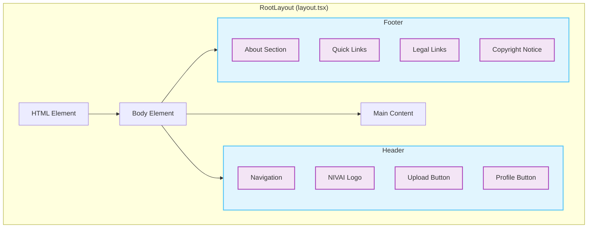
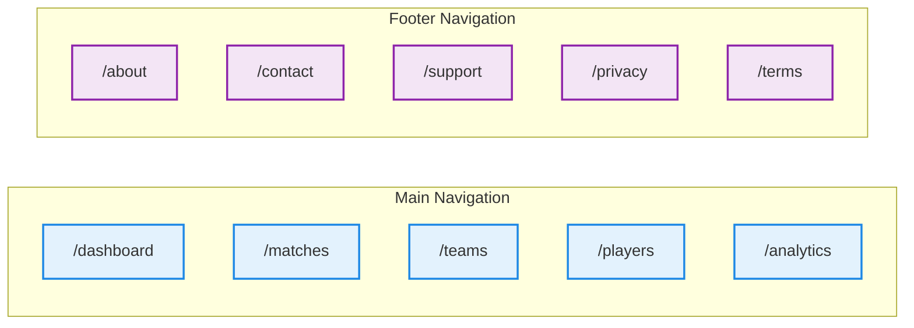

# Frontend Layout Documentation

> This document describes the root layout component that provides the consistent application shell, including navigation, metadata, and footer for the NIVAI frontend.

## Architecture



## Component Structure



## Navigation Schema



## Configuration

### Metadata

```typescript
export const metadata: Metadata = {
  title: "NIVAI - Football Analytics Platform",
  description:
    "Advanced football tracking data visualization and analysis platform",
  applicationName: "NIVAI Football Analytics",
};
```

### Font Configuration

```typescript
const inter = Inter({ subsets: ["latin"] });
```

## Layout Components

### Header Navigation

- Main navigation menu
- Upload action button
- User profile access
- Responsive design

### Footer Structure

1. **Company Information**

   - Platform description
   - Contact details

2. **Quick Links**

   - About Us
   - Contact
   - Support

3. **Legal Information**
   - Privacy Policy
   - Terms of Service
   - Copyright notice

## Styling

### Theme Colors

```css
Primary:
- Blue-800: #1E40AF (Navigation, buttons)
- Gray-700: #374151 (Text)
- White: #FFFFFF (Background)

Hover States:
- Blue-700: #1D4ED8 (Button hover)
- Blue-800: #1E40AF (Link hover)
```

### Layout Classes

```css
Container:
- max-w-7xl
- mx-auto
- px-4 sm:px-6 lg:px-8

Spacing:
- py-12 (Footer padding)
- space-y-2 (Link spacing)
- gap-8 (Grid gaps)
```

## Responsiveness

### Breakpoints

```css
sm: 640px  // Small devices
md: 768px  // Medium devices
lg: 1024px // Large devices
xl: 1280px // Extra large devices
```

## Usage Example

```tsx
// Page component using the layout
export default function HomePage() {
  return (
    // Layout automatically wraps the page content
    <div>
      <h1>Welcome to NIVAI</h1>
      <p>Your football analytics platform</p>
    </div>
  );
}
```

## Related Files

- `globals.css`: Global styles
- `page.tsx`: Home page component
- `components/Navigation.tsx`: Navigation component
- `components/Footer.tsx`: Footer component
