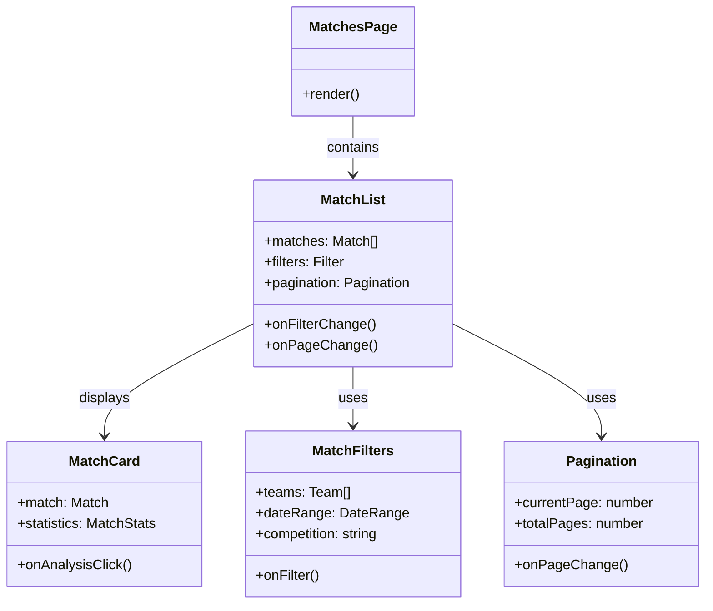
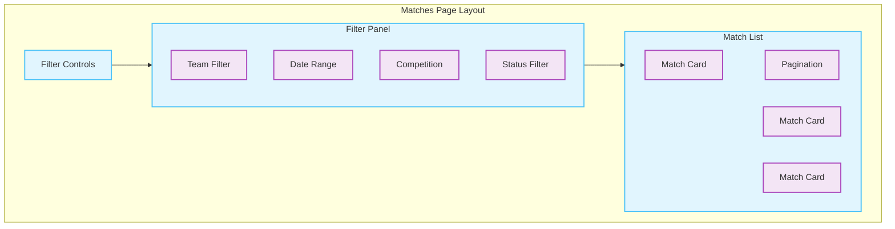
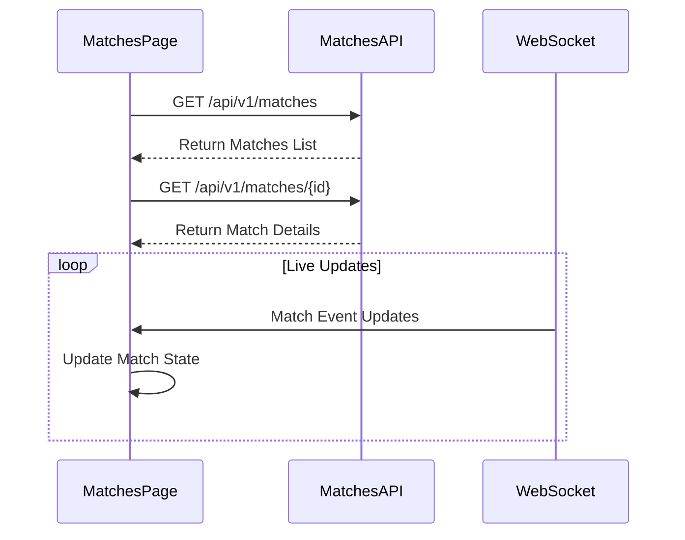

# Matches Page Documentation

> This document describes the matches page that provides match listings, filtering, and detailed match analysis in the AIFAA platform.

## Architecture



## Page Layout



## Data Models

### Match Interface

```typescript
interface Match {
  id: string;
  homeTeam: Team;
  awayTeam: Team;
  date: Date;
  competition: string;
  season: string;
  score?: {
    home: number;
    away: number;
  };
  status: "scheduled" | "live" | "completed" | "cancelled";
  venue: string;
  statistics?: MatchStatistics;
}

interface MatchStatistics {
  possession: {
    home: number;
    away: number;
  };
  shots: {
    home: number;
    away: number;
  };
  passes: {
    home: number;
    away: number;
  };
  // Additional statistics...
}
```

## State Management

### Filter State

```typescript
interface FilterState {
  teams: string[];
  dateRange: {
    start: Date | null;
    end: Date | null;
  };
  competition: string | null;
  status: MatchStatus | null;
  page: number;
  limit: number;
}
```

## API Integration



## Component Features

### 1. Match Card Display

- Team logos and names
- Score display
- Match date and time
- Competition badge
- Quick stats preview
- Analysis link

### 2. Filter Controls

- Team selection
- Date range picker
- Competition dropdown
- Status filter tabs

### 3. Match Statistics

- Possession percentage
- Shot analysis
- Pass completion
- Player performance
- Formation display

## Interactive Features

### 1. Live Updates

- Real-time score updates
- Live statistics
- Event notifications
- Status changes

### 2. Analysis Tools

- Video highlights
- Heat maps
- Player tracking
- Formation analysis

## Performance Optimizations

1. **Data Loading**

   - Paginated match loading
   - Infinite scroll support
   - Cached match data
   - Optimistic updates

2. **Filtering**
   - Debounced filter updates
   - Client-side filtering
   - Memoized filter results

## Error Handling

1. **API Errors**

   - Failed request recovery
   - Offline support
   - Retry mechanisms

2. **Data Validation**
   - Match data validation
   - Filter input validation
   - Date range checks

## Usage Example

```typescript
function MatchesContainer() {
  const [filters, setFilters] = useState<FilterState>(defaultFilters);
  const { data, isLoading } = useMatches(filters);

  return (
    <MatchesPage
      matches={data}
      filters={filters}
      onFilterChange={setFilters}
      isLoading={isLoading}
    />
  );
}
```

## Related Files

- `components/MatchCard.tsx`: Match display component
- `components/MatchFilters.tsx`: Filter controls
- `hooks/useMatches.ts`: Match data fetching
- `services/matchApi.ts`: API integration
