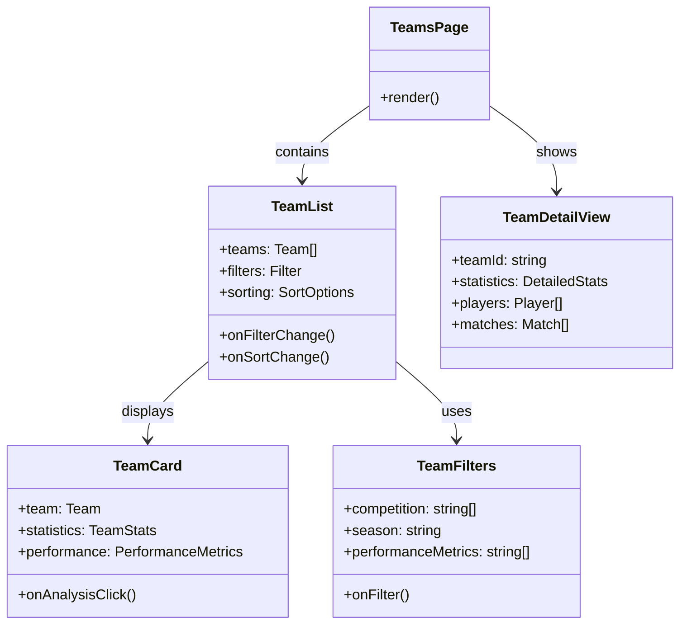
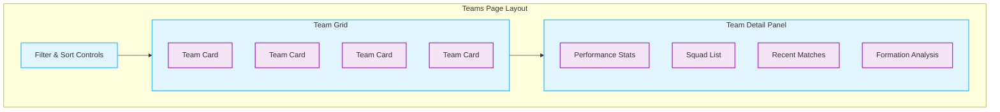

# Teams Page Documentation

> This document describes the teams page that provides team listings, performance analytics, and detailed statistics in the AIFAA platform.

## Architecture



## Page Layout



## Data Models

### Team Interface

```typescript
interface Team {
  id: string;
  name: string;
  shortName: string;
  logo: string;
  competition: string;
  season: string;
  stats: TeamStatistics;
  squad: Player[];
  recentForm: MatchResult[];
}

interface TeamStatistics {
  matches: {
    played: number;
    won: number;
    drawn: number;
    lost: number;
  };
  goals: {
    scored: number;
    conceded: number;
    difference: number;
  };
  performance: {
    possession: number;
    passAccuracy: number;
    shotsPerGame: number;
    // Additional metrics...
  };
}
```

## Performance Analysis

```mermaid
graph LR
    subgraph Performance["Performance Metrics"]
        P1[Possession]
        P2[Pass Accuracy]
        P3[Shot Accuracy]
        P4[Goals per Game]
    end

    subgraph Tactics["Tactical Analysis"]
        T1[Formation]
        T2[Play Style]
        T3[Press Stats]
    end

    subgraph Trends["Performance Trends"]
        TR1[Form]
        TR2[Goal Trend]
        TR3[Position Trend]
    end

    Performance --> Tactics
    Tactics --> Trends

    classDef metrics fill:#e3f2fd,stroke:#1e88e5,stroke-width:2px;
    classDef analysis fill:#f3e5f5,stroke:#8e24aa,stroke-width:2px;

    class P1,P2,P3,P4 metrics;
    class T1,T2,T3,TR1,TR2,TR3 analysis;
```



## Interactive Features

### 1. Team Comparison

- Head-to-head statistics
- Performance radar charts
- Historical matchups
- Style analysis

### 2. Squad Management

- Player statistics
- Formation builder
- Injury tracking
- Performance trends

### 3. Match Analysis

- Recent results
- Upcoming fixtures
- Performance forecasting
- Historical data

## Data Visualization

### 1. Performance Charts

- Radar charts for team metrics
- Timeline for form analysis
- Heat maps for positioning
- Pass networks

### 2. Statistical Analysis

- League position tracking
- Goal distribution charts
- Player contribution graphs
- Opposition analysis

## Performance Optimizations

1. **Data Management**

   - Cached team data
   - Incremental updates
   - Background data loading
   - Real-time sync

2. **UI Performance**
   - Virtual scrolling
   - Lazy image loading
   - Debounced search
   - Optimized rendering

## Error States

1. **Data Loading**

   - Loading skeletons
   - Error boundaries
   - Retry mechanisms
   - Fallback content

2. **User Feedback**
   - Toast notifications
   - Progress indicators
   - Status messages
   - Error details

## Usage Example

```typescript
function TeamsContainer() {
  const [selectedTeam, setSelectedTeam] = useState<string | null>(null);
  const { teams, isLoading } = useTeams();
  const { data: teamDetails } = useTeamDetails(selectedTeam);

  return (
    <TeamsPage
      teams={teams}
      selectedTeam={teamDetails}
      onTeamSelect={setSelectedTeam}
      isLoading={isLoading}
    />
  );
}
```

## Related Files

- `components/TeamCard.tsx`: Team card component
- `components/TeamStats.tsx`: Statistics display
- `hooks/useTeam.ts`: Team data management
- `services/teamApi.ts`: API integration
