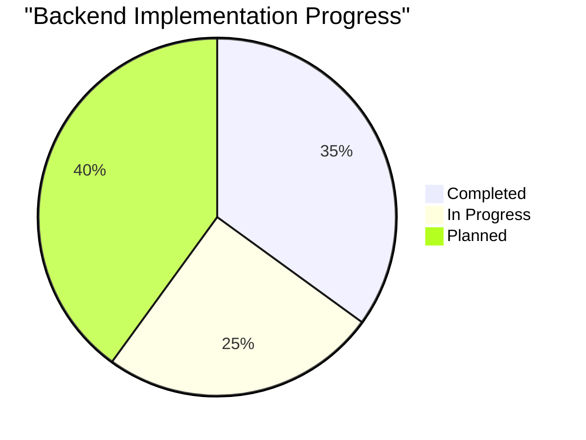
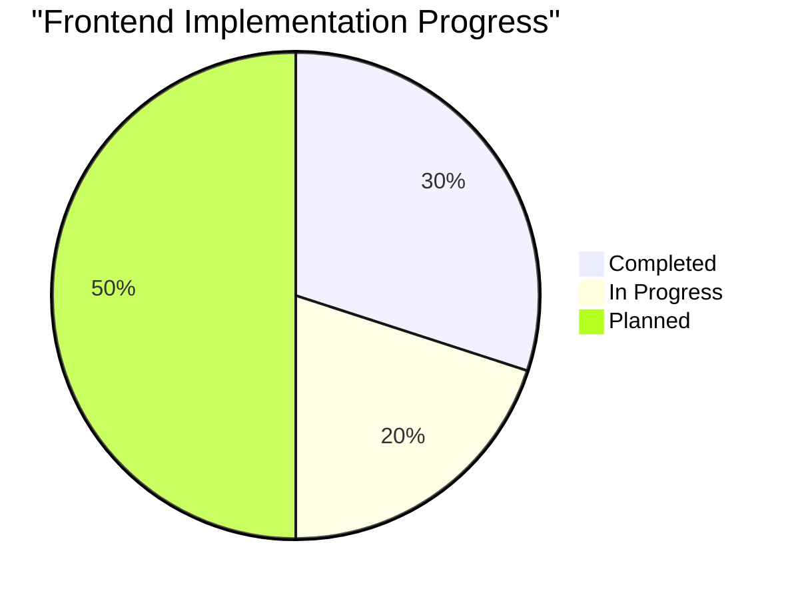
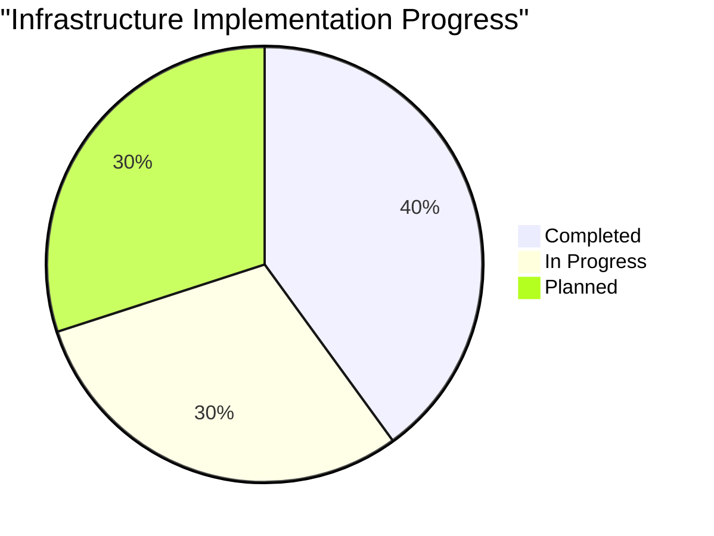

# Active Development Context

## Current Focus

The NIVAI project is currently in the Phase 1 (Foundation) stage of development, focusing on implementing the core architecture and essential functionality for the football analytics platform.

### Priority Areas

1. **Backend API Development**

   - Implementing core API endpoints for video and tracking data management
   - Setting up authentication and authorization
   - Creating data models and services
   - Implementing WebSocket support for real-time updates

2. **Frontend Interface Development**

   - Building responsive dashboard layout
   - Developing upload functionality for videos and tracking data
   - Implementing UI components for data visualization
   - Creating page structure and navigation

3. **Infrastructure Setup**
   - Creating containerization with Docker
   - Deploying to Kubernetes with proper scaling and security
   - Setting up cloud resources with Terraform
   - Implementing monitoring and logging

## Implementation Status

### Backend (Go)

| Component                   | Status      | Notes                                 |
| --------------------------- | ----------- | ------------------------------------- |
| Basic API Structure         | Complete    | Routes, controllers, middleware setup |
| Authentication              | In Progress | JWT implementation in progress        |
| Video API                   | In Progress | Core endpoints implemented            |
| WebSocket Controller        | In Progress | Initial implementation                |
| Storage Service             | In Progress | Azure Blob integration                |
| Data Processing Integration | Planned     | To be implemented in next sprint      |

### Frontend (Next.js)

| Component                       | Status      | Notes                                       |
| ------------------------------- | ----------- | ------------------------------------------- |
| Project Setup                   | Complete    | Next.js 14 with TypeScript and Tailwind CSS |
| Layout & Navigation             | Complete    | Base layout with responsive design          |
| Dashboard Page                  | In Progress | Initial statistics and charts               |
| Upload Page                     | In Progress | Form and upload functionality               |
| Video Player                    | Planned     | To be implemented next                      |
| Interactive Pitch Visualization | Planned     | Pending Pixi.js integration                 |

### Infrastructure

| Component            | Status      | Notes                                 |
| -------------------- | ----------- | ------------------------------------- |
| Docker Configuration | Complete    | Multi-stage builds for optimal images |
| Kubernetes Manifests | In Progress | Deployments, services, and ingress    |
| Terraform for Azure  | In Progress | AKS, Storage, and Redis setup         |
| CI/CD Pipeline       | Planned     | Will use GitHub Actions               |
| Monitoring Setup     | Planned     | Will use Prometheus and Grafana       |

## Current Challenges

1. **Video Processing Performance**

   - Challenge: Handling large video files efficiently
   - Approach: Investigating stream processing and chunking strategies
   - Status: Research in progress

2. **Real-time Data Synchronization**

   - Challenge: Synchronizing video playback with tracking data
   - Approach: Implementing WebSocket-based solution with frame markers
   - Status: Initial implementation being tested

3. **Storage Cost Optimization**

   - Challenge: Managing storage costs for large video files
   - Approach: Implementing tiered storage strategy and compression
   - Status: Evaluating options

4. **Interactive Visualization Performance**
   - Challenge: Smooth rendering of tracking data visualizations
   - Approach: Using Pixi.js with WebGL for hardware-accelerated rendering
   - Status: Prototype in development

## Next Steps

### Short Term (Current Sprint)

- Complete WebSocket controller implementation
- Finish video upload and management functionality
- Implement initial dashboard visualizations
- Deploy basic infrastructure to development environment

### Medium Term (Next 3 Sprints)

- Implement tracking data processing pipeline
- Develop interactive pitch visualization component
- Add user management and authorization
- Complete CI/CD pipeline setup

### Long Term (Next 3 Months)

- Implement advanced analytics features
- Develop collaborative annotation system
- Create export and reporting functionality
- Set up production infrastructure with proper monitoring

## Dependencies and Integration Points

1. **Azure Blob Storage**

   - Purpose: Store video files and tracking data
   - Integration: Storage service in Go backend
   - Status: Basic integration complete

2. **Redis Cache**

   - Purpose: Cache frequently accessed data and WebSocket management
   - Integration: Through Go Redis client
   - Status: Configuration ready, implementation pending

3. **PostgreSQL Database**

   - Purpose: Store structured data (metadata, user information)
   - Integration: Through Go database/sql with proper migration
   - Status: Schema design complete, implementation pending

4. **Pixi.js**
   - Purpose: High-performance visualization for tracking data
   - Integration: Frontend React components
   - Status: Research complete, implementation planned
