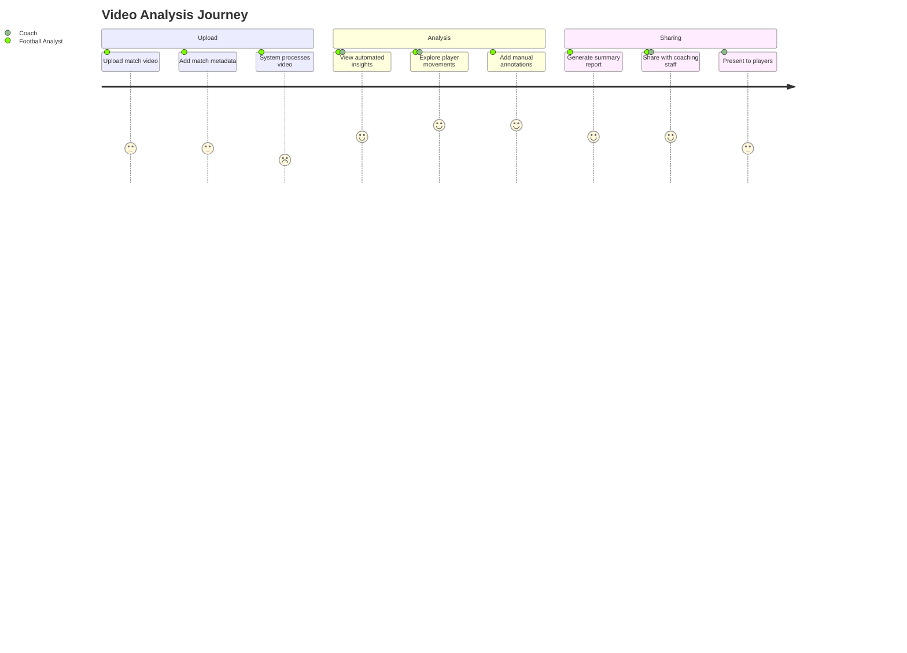
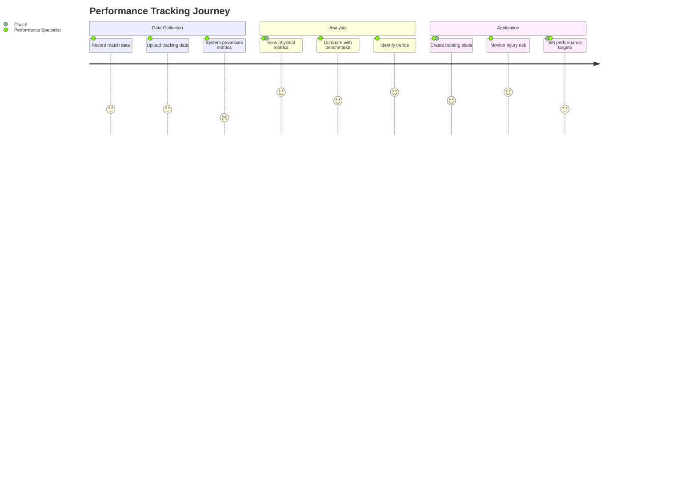

# Product Context

## User Personas

### Football Analyst

- **Description**: Professional analyst working for football clubs or associations
- **Goals**: Analyze match footage, extract tactical insights, create reports
- **Needs**: Fast video processing, advanced analytics tools, data export capabilities
- **Pain Points**: Manual video analysis is time-consuming, difficult to quantify insights

### Football Coach

- **Description**: Team coach responsible for tactics and player development
- **Goals**: Improve team performance, develop game plans, communicate tactics to players
- **Needs**: Visual representation of tactics, player performance metrics, sharable insights
- **Pain Points**: Difficulty communicating complex tactical concepts, limited time for analysis

### Performance Specialist

- **Description**: Focuses on physical aspects of player performance
- **Goals**: Monitor player workload, prevent injuries, optimize training regimens
- **Needs**: Physical metrics, heat maps, sprint analysis, comparisons over time
- **Pain Points**: Integrating physical data with tactical context, building longitudinal data

### Football Federation Official

- **Description**: Representative from national/regional football associations
- **Goals**: Monitor competition quality, talent identification, referee performance
- **Needs**: Aggregated reports, competition-wide analytics, standardized metrics
- **Pain Points**: Inconsistent data quality, difficult comparison across leagues/teams

## User Journeys

### Video Analysis Journey

### Performance Tracking Journey

## Key Features

### 1. Video Management and Processing

- **Description**: Upload, store, organize, and process football match videos
- **User Value**: Central repository for match footage with metadata and search capabilities
- **Key Components**:
  - Video upload with metadata tagging
  - Automatic processing and indexing
  - Video streaming with variable quality
  - Clip creation and export

### 2. Tracking Data Visualization

- **Description**: Interactive visualization of player and ball movement data
- **User Value**: Transform complex positional data into intuitive visual representations
- **Key Components**:
  - Heat maps showing player positions and movements
  - Interactive pitch view with player tracking
  - Time-synchronized video and tracking data
  - Formation analysis and transitions

### 3. Performance Analytics Dashboard

- **Description**: Comprehensive metrics and KPIs for team and player performance
- **User Value**: Quantifiable insights into performance patterns and trends
- **Key Components**:
  - Team and player statistics
  - Physical performance metrics
  - Possession analysis
  - Passing networks and patterns

### 4. Collaborative Analysis Tools

- **Description**: Features enabling multiple users to collaborate on analysis
- **User Value**: Facilitate knowledge sharing and collaborative decision making
- **Key Components**:
  - Shared annotations and comments
  - Collaborative playlists and collections
  - Permission-based sharing
  - Notification system for updates

### 5. Report Generation

- **Description**: Tools to create and export professional reports from analysis
- **User Value**: Effectively communicate insights to players, coaches, and stakeholders
- **Key Components**:
  - Customizable report templates
  - Export to multiple formats (PDF, PowerPoint)
  - Interactive digital reports
  - Statistical and visual summaries

## Product Roadmap

### Phase 1: Foundation (Current Phase)

- Basic video upload and management
- Essential tracking data visualization
- Core dashboard functionality
- User authentication and security

### Phase 2: Enhanced Analysis (3-6 months)

- Advanced tracking data processing
- AI-assisted event detection
- Team comparison tools
- Enhanced visualization options

### Phase 3: Collaboration and Integration (6-12 months)

- Real-time collaborative analysis
- Integration with external tracking systems
- Mobile app for on-field access
- API for third-party integrations

### Phase 4: Advanced Intelligence (12-18 months)

- Predictive analytics for performance and tactics
- Pattern recognition across multiple matches
- Personalized insights based on user behavior
- Machine learning models for automated analysis

## User Interface Guidelines

### Design Principles

- **Clarity**: Present complex data in intuitive, easy-to-understand visualizations
- **Efficiency**: Optimize workflows for frequent analysis tasks
- **Consistency**: Maintain consistent interaction patterns throughout the application
- **Accessibility**: Ensure the platform is usable by people with different abilities

### Brand Identity

- **Color Palette**: Primary blue (#1a56db), secondary orange (#e27a3f), accent green (#34d399)
- **Typography**: Inter for UI text, Roboto Mono for data displays
- **Iconography**: Simple, consistent line icons
- **Visual Style**: Clean, professional, data-focused design with ample whitespace

### UI Components

- Interactive pitch visualization
- Video player with annotation capabilities
- Data tables with sorting and filtering
- Dashboard cards for key metrics
- Timeline controls for tracking data playback

## Localization Strategy

- Initial launch in English and Dutch
- Future expansion to support French, German, and Spanish
- Localized terminology for football concepts
- Support for different measurement units (metric/imperial)
- Region-specific data formats (dates, times, numbers)
