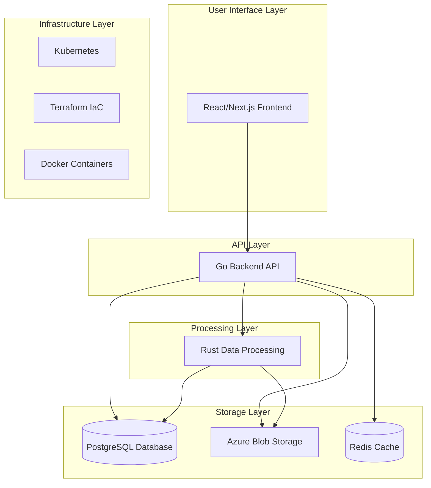

# NIVAI Project Brief

## Project Overview

NIVAI (Netherlands Institute for Video Analysis and Intelligence) is an advanced football tracking data visualization and analysis platform designed for the KNVB (Royal Dutch Football Association). The platform enables football analysts, coaches, and teams to upload, process, and analyze match videos and tracking data to gain tactical insights and performance metrics.

## Core Objectives

1. **Video Analysis**: Process and analyze football match videos to extract meaningful data
2. **Real-time Tracking**: Visualize player and ball tracking data synchronized with video footage
3. **Interactive Dashboard**: Provide intuitive dashboards for tactical and performance analysis
4. **Multi-platform Access**: Deliver a responsive web application accessible on various devices

## Architecture Overview

## Key Features

- **Video Upload & Management**: Upload, store, and organize football match videos
- **Tracking Data Integration**: Process and visualize player movement and event data
- **Interactive Analysis Tools**: Heat maps, player movement paths, tactical formations
- **Real-time Collaboration**: WebSocket-powered real-time updates and annotations
- **Performance Metrics Dashboard**: Comprehensive statistics and performance indicators

## Technology Stack

- **Frontend**: React.js with Next.js, TypeScript, Tailwind CSS
- **Backend API**: Go (Golang)
- **Data Processing**: Rust
- **Database**: PostgreSQL
- **Storage**: Azure Blob Storage
- **Caching**: Redis
- **Infrastructure**: Docker, Kubernetes, Terraform
- **CI/CD**: GitHub Actions
- **Monitoring**: Prometheus, Grafana

## Development Approach

- **Architecture**: Microservices-based architecture
- **Methodology**: Agile development with CI/CD
- **Code Quality**: Emphasis on test coverage, code reviews, and SOLID principles
- **Security**: Comprehensive security measures following OWASP guidelines
