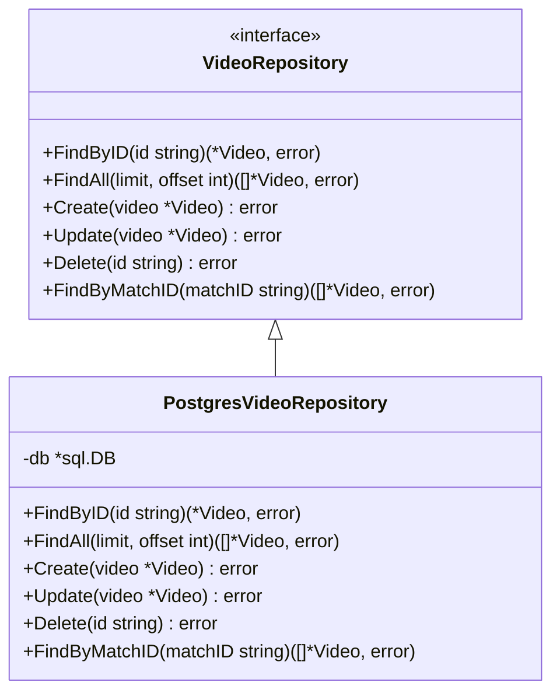
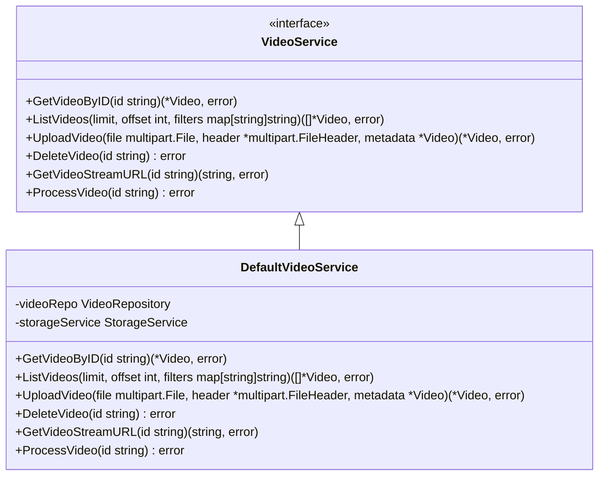
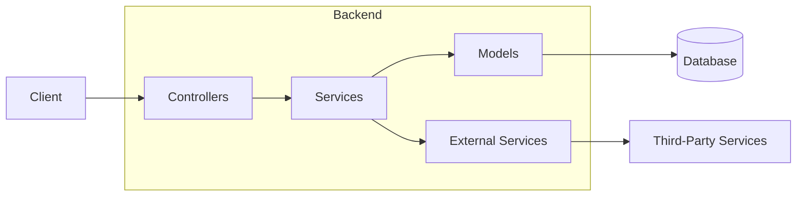
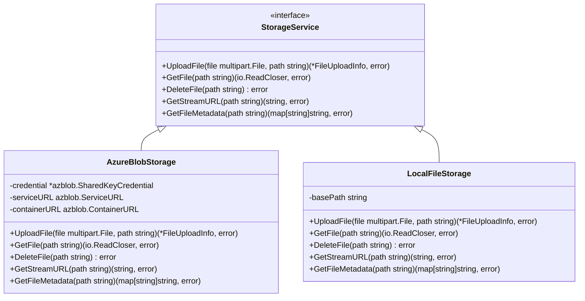

# System Patterns

This document outlines the key architectural patterns, design principles, and code organization standards used throughout the NIVAI project.

## Architectural Patterns

### Repository Pattern

The NIVAI backend implements the Repository pattern to abstract data access operations and separate business logic from database interactions.



### Service Layer Pattern

Services encapsulate business logic and orchestrate operations across multiple repositories and external systems.



### MVC-Inspired Pattern (for Web API)

While not strictly MVC, the backend follows a similar separation of concerns:



### Strategy Pattern

The NIVAI platform uses the Strategy pattern for flexible algorithm selection in data processing:



## Design Principles

### SOLID Principles

#### Single Responsibility Principle (SRP)

Each component in the NIVAI system has a single responsibility:

- Controllers: Handle HTTP requests and responses
- Services: Implement business logic
- Repositories: Handle data access operations
- Models: Define data structures

#### Open/Closed Principle (OCP)

Components are designed to be open for extension but closed for modification:

- Services use interfaces for dependencies, allowing alternative implementations
- The storage system supports multiple storage providers without modifying existing code
- Controllers accept service interfaces rather than concrete implementations

#### Liskov Substitution Principle (LSP)

Derived classes can be substituted for their base classes:

- Different repository implementations (PostgreSQL, in-memory for testing)
- Different storage service implementations (Azure Blob Storage, local file system)

#### Interface Segregation Principle (ISP)

Interfaces are kept focused and specific:

- VideoRepository focuses only on video data operations
- StorageService focuses only on storage operations
- Services have specific interfaces tailored to their use cases

#### Dependency Inversion Principle (DIP)

High-level modules depend on abstractions, not concrete implementations:

- Controllers depend on service interfaces, not concrete service classes
- Services depend on repository and storage interfaces, not concrete implementations

### Additional Principles

#### Separation of Concerns

Clear separation between:

- UI rendering and user interaction
- API request handling
- Business logic
- Data access
- Infrastructure concerns

#### Don't Repeat Yourself (DRY)

- Common functionality is extracted into utility functions
- Shared code patterns are standardized
- Configuration is centralized

#### Composition Over Inheritance

- Services compose multiple repositories and external services
- Components are designed to be composed rather than extended through inheritance

## Code Organization

### Backend (Go)

```
backend/
├── cmd/               # Entry points for executable applications
│   └── api/           # Main API application
├── pkg/               # Package code
│   ├── config/        # Configuration handling
│   ├── controllers/   # HTTP request handlers
│   ├── middleware/    # HTTP middleware components
│   ├── models/        # Data models and repositories
│   ├── routes/        # API route definitions
│   └── services/      # Business logic services
└── tests/             # Test suite
```

### Frontend (Next.js)

```
frontend/
├── public/            # Static assets
└── src/               # Source code
    ├── app/           # Next.js app directory
    │   ├── api/       # API routes
    │   ├── dashboard/ # Dashboard page
    │   └── upload/    # Upload page
    ├── components/    # Reusable UI components
    ├── hooks/         # Custom React hooks
    ├── lib/           # Utility functions and services
    └── types/         # TypeScript type definitions
```

### Infrastructure

```
infrastructure/
├── docker/            # Dockerfiles
├── kubernetes/        # Kubernetes manifests
├── monitoring/        # Monitoring configuration
└── terraform/         # Infrastructure as Code
    ├── environments/  # Environment-specific configurations
    └── modules/       # Reusable Terraform modules
```

## Coding Standards

### Go

- Follow the [Go Code Review Comments](https://github.com/golang/go/wiki/CodeReviewComments)
- Use explicit error handling and meaningful error messages
- Document all exported functions, types, and packages
- Embrace Go's simplicity and conciseness
- Leverage interfaces for abstraction and testing

### TypeScript/JavaScript

- Follow the [Airbnb JavaScript Style Guide](https://github.com/airbnb/javascript)
- Use TypeScript interfaces for complex data structures
- Leverage React hooks for state management
- Document components with JSDoc comments
- Use functional components over class components

### Infrastructure

- Apply the principle of immutable infrastructure
- Use parameterized templates for different environments
- Document all configuration options
- Minimize manual intervention requirements
