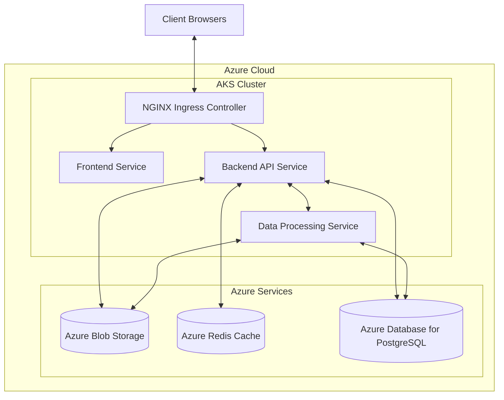
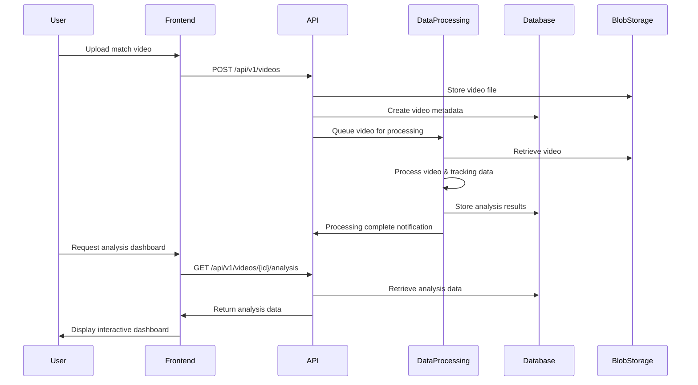

# Technical Context

## System Architecture

NIVAI employs a modern, cloud-native, microservices architecture that separates concerns into distinct layers while ensuring high performance, scalability, and maintainability.

## Component Details

### Frontend (Next.js)

- **Technology**: Next.js 14 with React, TypeScript, and Tailwind CSS
- **Responsibility**: Serve the web application, handle client-side rendering and server-side rendering
- **Key Features**:
  - Dashboard for football analytics visualization
  - Video player with synchronized tracking data
  - Upload interface for videos and tracking data
  - User authentication and permissions

### Backend API (Go)

- **Technology**: Go (Golang) with standard libraries and minimal dependencies
- **Responsibility**: Handle API requests, business logic, data access, and service coordination
- **Key Components**:
  - Controllers: Handle HTTP requests and responses
  - Services: Implement business logic and coordinate operations
  - Models: Define data structures and database operations
  - Middleware: Handle cross-cutting concerns like authentication and logging

### Data Processing (Rust)

- **Technology**: Rust with high-performance data processing libraries
- **Responsibility**: Process video and tracking data, extract insights, generate analytics
- **Key Features**:
  - Video frame extraction and analysis
  - Player tracking data processing
  - Statistical calculations and event detection
  - Real-time data transformation for visualization

## Infrastructure

### Containerization

- Docker-based containers for all services
- Multi-stage builds for optimal image sizes
- Environment-specific configurations

### Kubernetes Deployment

- Azure Kubernetes Service (AKS) for orchestration
- Deployment manifests for declarative configuration
- Horizontal Pod Autoscaling (HPA) for dynamic scaling
- NGINX Ingress Controller for traffic management

### Infrastructure as Code

- Terraform modules for Azure resource provisioning
- Environment-specific configurations (dev, test, prod)
- Automated infrastructure deployment

## Data Flow

## API Structure

The API follows RESTful principles with the following main endpoints:

- `/api/v1/auth`: Authentication endpoints
- `/api/v1/videos`: Video resource endpoints
- `/api/v1/tracking`: Tracking data endpoints
- `/api/v1/analysis`: Analysis results endpoints
- `/api/v1/ws`: WebSocket connections for real-time updates

## Security Considerations

- JWT-based authentication
- HTTPS encryption for all traffic
- Role-based access control (RBAC)
- Input validation and sanitization
- Azure Key Vault for secrets management
- Regular security audits and updates

## Monitoring and Observability

- Prometheus for metrics collection
- Grafana for visualization and dashboards
- Structured logging with context
- Distributed tracing for request flow analysis
